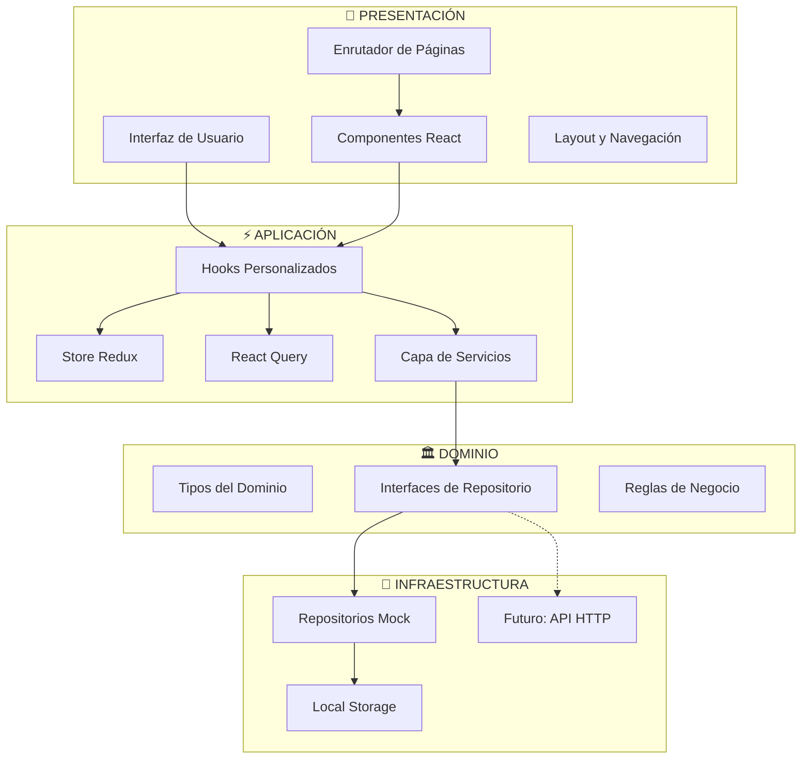

# Sistema de Gestión de Artículos

<div align="center">


**[🚀 Demo en Vivo](https://article-manager-steel.vercel.app/articles)**

</div>

## 🌐 Idiomas Disponibles

- **English** - [README.md](./README.md)
- **Español** - [README.es.md](./README.es.md) (actual)

---

## Tabla de Contenidos

1. [Descripción General](#descripción-general)
2. [Últimas Actualizaciones](#últimas-actualizaciones)
3. [Tecnologías Utilizadas](#tecnologías-utilizadas)
4. [Arquitectura del Proyecto](#arquitectura-del-proyecto)
5. [Estructura de Directorios](#estructura-de-directorios)
6. [Gestión de Estado](#gestión-de-estado)
7. [Instalación y Configuración](#instalación-y-configuración)
8. [Scripts Disponibles](#scripts-disponibles)
9. [Estrategia de Testing](#estrategia-de-testing)
10. [Despliegue](#despliegue)
11. [Componentes Principales](#componentes-principales)
12. [Preguntas Frecuentes](#preguntas-frecuentes)

## Descripción General

El Sistema de Gestión de Artículos es una aplicación web moderna desarrollada con React que permite a los usuarios gestionar artículos con funcionalidades completas:

- ✅ **Operaciones CRUD**: Crear, editar y eliminar artículos
- ⭐ **Sistema de Calificaciones**: Funcionalidad de calificación de 1-5 estrellas
- ❤️ **Sistema de Favoritos**: Marcar artículos como favoritos con página dedicada
- 🔍 **Filtrado Avanzado**: Filtrar por categoría, subcategoría, calificación mínima, búsqueda
- 📱 **Diseño Responsive**: Enfoque mobile-first con Tailwind CSS
- 🧪 **Testing Completo**: Cobertura de pruebas unitarias, integración y E2E
- 🎨 **UI/UX Moderno**: Animaciones suaves y navegación intuitiva
- 🔧 **Validación HTML5**: Validación mejorada de formularios para mejor UX

## Últimas Actualizaciones

### 🐛 **Corrección Bug Filtros de Categorías** (v2.1)

- **Problema**: Los filtros de categoría (technology, business, science) no se aplicaban inmediatamente
- **Causa Raíz**: Falta de sincronización entre parámetros URL y estado local de filtros
- **Solución**: Implementado `useEffect` para sincronización automática de filtros
- **Impacto**: Aplicación instantánea de filtros con mejor experiencia de usuario
- **Archivos Actualizados**: `src/pages/categories/CategoriesPage.tsx`

### 🎯 **Sistema de Favoritos Completo** (v2.0)

- **FavoritesPage**: Página dedicada con diseño elegante de estado vacío
- **Integración de Navegación**: Link consistente "Favorites" en el header
- **Sincronización en Tiempo Real**: Actualizaciones optimistas con React Query
- **Persistencia**: Integración con LocalStorage y sincronización automática
- **Cobertura de Pruebas**: 15/15 pruebas unitarias comprensivas incluyendo favoritos

### 🔧 **Validación de Formularios Mejorada** (v1.9)

- **Validación HTML5**: Atributos required en campos obligatorios
- **Accesibilidad**: IDs únicos y labels apropiados para lectores de pantalla
- **Testing E2E**: Verificación del comportamiento de validación de formularios
- **Consistencia UX**: Validación uniforme en todos los formularios

## Tecnologías Utilizadas

### Frontend Core

- **React 19.1.1** - Biblioteca UI moderna
- **TypeScript 5.9.3** - Verificación de tipos estáticos
- **Vite 7.1.7** - Herramienta de build rápida y servidor dev
- **Node.js 22** - Entorno de ejecución

### Gestión de Paquetes

- **Bun** (recomendado) - Runtime y gestor de paquetes ultra-rápido
- **npm** (alternativo) - Gestor de paquetes tradicional de Node.js

### Gestión de Estado

- **Redux Toolkit 2.9.0** - Gestión de estado UI global
- **React Query 5.90.2** - Estado del servidor y caché

### Estilos y UI

- **Tailwind CSS 4.1.14** - Framework CSS utility-first
- **Lucide React** - Iconos hermosos
- **Motion (Framer Motion) 12.23.24** - Animaciones suaves

### Testing

- **Vitest** - Pruebas unitarias e integración
- **Cypress** - Pruebas end-to-end
- **Testing Library** - Utilidades para pruebas de componentes React

## Arquitectura del Proyecto

Este proyecto implementa **Arquitectura Hexagonal (Ports & Adapters)** combinada con **Vertical Slice Architecture** para máxima mantenibilidad y escalabilidad.

### Diagrama de Arquitectura



### Capas Arquitectónicas

```
┌─────────────────────────────────────┐
│           PRESENTACIÓN              │
│    (Components, Pages, Hooks)       │
├─────────────────────────────────────┤
│            APLICACIÓN               │
│      (Services, Store, Query)       │
├─────────────────────────────────────┤
│             DOMINIO                 │
│    (Types, Interfaces, Rules)       │
├─────────────────────────────────────┤
│         INFRAESTRUCTURA            │
│   (Repositories, External APIs)     │
└─────────────────────────────────────┘
```

## Gestión de Estado

### Estrategia Redux vs React Query

El proyecto usa un **enfoque híbrido** que separa claramente las responsabilidades:

#### 🏪 **Redux Toolkit - Estado UI/Cliente**

**Lo que gestiona Redux:**

- ✅ Configuración UI: tema, idioma, preferencias
- ✅ Estado de navegación: página actual, breadcrumbs
- ✅ Estados globales: spinners de carga, notificaciones
- ✅ Datos que persisten entre páginas: configuración del usuario

#### ⚡ **React Query - Estado del Servidor**

**Lo que gestiona React Query:**

- 📊 Datos del servidor: artículos, calificaciones, favoritos
- 🔄 Caché inteligente: evita peticiones innecesarias
- ⚡ Sincronización: mantiene datos actualizados
- 🔄 Mutaciones: CREATE, UPDATE, DELETE con invalidación de caché

### Beneficios de Esta Arquitectura

1. **🎯 Separación Clara**: Cada herramienta para su propósito específico
2. **⚡ Performance**: Caché optimizado para datos del servidor
3. **🔧 Mantenibilidad**: Menos boilerplate para estado del servidor
4. **🎭 UX Superior**: Estados de carga/error automáticos
5. **🧪 Testing**: Más fácil mockear datos del servidor
6. **📈 Escalabilidad**: Fácil agregar nuevos endpoints

## Estructura de Directorios

```
src/
├── application/           # Capa de Aplicación
│   ├── hooks/            # Hooks Redux personalizados
│   ├── store/            # Configuración Redux
│   └── queryClient.ts    # Configuración React Query
│
├── domain/               # Capa de Dominio
│   ├── repositories.ts   # Interfaces de repositorios
│   └── types.ts         # Tipos del dominio
│
├── infrastructure/       # Capa de Infraestructura
│   └── repositories/    # Implementaciones de repositorios
│       ├── MockArticleRepository.ts
│       ├── MockRatingRepository.ts
│       └── MockFavoriteRepository.ts
│
├── features/            # Slices Verticales por Feature
│   └── articles/
│       ├── components/  # Componentes específicos del feature
│       ├── hooks/      # Hooks del dominio
│       ├── services/   # Servicios e inyección
│       └── __tests__/  # Pruebas del feature
│
├── pages/              # Páginas de la aplicación
│   ├── articles/
│   ├── categories/
│   └── favorites/
│
├── shared/             # Código compartido
│   ├── components/     # Componentes reutilizables
│   ├── constants/      # Constantes globales
│   ├── types/         # Tipos compartidos
│   └── utils/         # Utilidades
│
└── components/         # Layout y componentes de app
```

## Instalación y Configuración

### Requisitos del Sistema

- **Node.js 22** - Versión de runtime requerida
- **Bun** (recomendado) o **npm** - Gestor de paquetes

### Proceso de Instalación

1. **Instalar Node.js versión 22**
   - Descargar desde [nodejs.org](https://nodejs.org/)
   - Verificar instalación: `node --version`

2. **Instalar dependencias**

   ```bash
   # Con Bun (recomendado)
   bun install

   # Con npm (alternativo)
   npm install
   ```

3. **Ejecutar el proyecto**

   ```bash
   # Con Bun
   bun run dev

   # Con npm
   npm run dev
   ```

   La aplicación estará disponible en `http://localhost:5173`

## Scripts Disponibles

### Con Bun (Recomendado)

```bash
# Desarrollo
bun dev              # Servidor de desarrollo
bun run build        # Build de producción
bun run preview      # Preview del build

# Calidad de Código
bun run lint         # ESLint
bun run lint:fix     # Auto-corrección
bun run format       # Formateo con Prettier

# Testing
bun test             # Pruebas unitarias (modo watch)
bun run test:run     # Pruebas unitarias (ejecución única)
bun run test:ui      # UI de Vitest
bun run cypress:open # Cypress interactivo
bun run cypress:run  # Cypress headless
```

### Con npm (Alternativo)

```bash
# Desarrollo
npm run dev          # Servidor de desarrollo
npm run build        # Build de producción
npm run preview      # Preview del build

# Testing
npm run test         # Pruebas unitarias (modo watch)
npm run test:run     # Pruebas unitarias (ejecución única)
npm run cypress:open # Cypress interactivo
npm run cypress:run  # Cypress headless
```

## Estrategia de Testing

### Cobertura de Pruebas: 15/15 ✅

#### 1. Pruebas Unitarias (Vitest + Testing Library)

```typescript
describe('ArticleCard', () => {
  test('muestra información del artículo correctamente', () => {
    render(<ArticleCard article={mockArticle} />);
    expect(screen.getByText(mockArticle.title)).toBeInTheDocument();
  });
});
```

#### 2. Pruebas de Integración

```typescript
describe('FavoritesIntegration', () => {
  test('debería alternar favorito y sincronizar con estado del servidor', async () => {
    // Pruebas de funcionalidad completa
  });
});
```

#### 3. Pruebas E2E (Cypress)

```typescript
describe('Flujo Completo de Gestión de Artículos', () => {
  it('debería completar el ciclo de vida completo del artículo', () => {
    cy.visit('/articles');
    cy.get('[data-testid="create-article"]').click();
    // Pruebas del flujo completo del usuario
  });
});
```

## Despliegue

### Configuración Vercel

El proyecto está desplegado en **Vercel** con optimización SPA:

```json
// vercel.json
{
  "rewrites": [{ "source": "/(.*)", "destination": "/index.html" }]
}
```

**Beneficios:**

- ✅ Soporte de enrutamiento del lado del cliente
- ✅ Recarga de página funciona en todas las rutas
- ✅ Prevención de 404 para rutas SPA
- ✅ Distribución CDN global

## Componentes Principales

### ArticleCard

- **Ubicación**: `src/features/articles/components/ArticleCard/`
- **Características**: Calificación, favoritos, editar, eliminar acciones

### ArticleForm

- **Ubicación**: `src/features/articles/components/ArticleForm/`
- **Características**: Crear/editar artículos con validación TypeScript

### FavoritesPage

- **Ubicación**: `src/pages/favorites/FavoritesPage.tsx`
- **Características**: Página de favoritos dedicada con estado vacío elegante

### Layout

- **Ubicación**: `src/components/Layout.tsx`
- **Características**: Navegación consistente con diseño responsive

## Preguntas Frecuentes

### ¿Por qué Arquitectura Hexagonal?

**Beneficios:**

- 🎯 **Separación clara** entre lógica de negocio y preocupaciones externas
- 🔄 **Testing fácil** con dependencias mockeables
- 📦 **Independencia tecnológica** - se pueden intercambiar implementaciones
- 🚀 **Mantenibilidad** - cambios aislados a capas específicas

### ¿Por qué Redux + React Query?

**Fortalezas complementarias:**

- Redux excele en estado UI que no requiere sincronización con servidor
- React Query excele en datos del servidor con caché inteligente
- Juntos proporcionan rendimiento óptimo y experiencia de desarrollador

---

## Conclusión

Este proyecto demuestra una implementación sólida de principios arquitectónicos modernos, combinando Vertical Slice Architecture con Arquitectura Hexagonal para crear una base de código mantenible, testeable y escalable. La separación clara entre dominio, aplicación e infraestructura, junto con TypeScript y herramientas modernas, proporciona una base robusta para aplicaciones React empresariales.

---

<div align="center">

**Hecho con ❤️ usando React, TypeScript, y Tecnologías Web Modernas**

</div>
