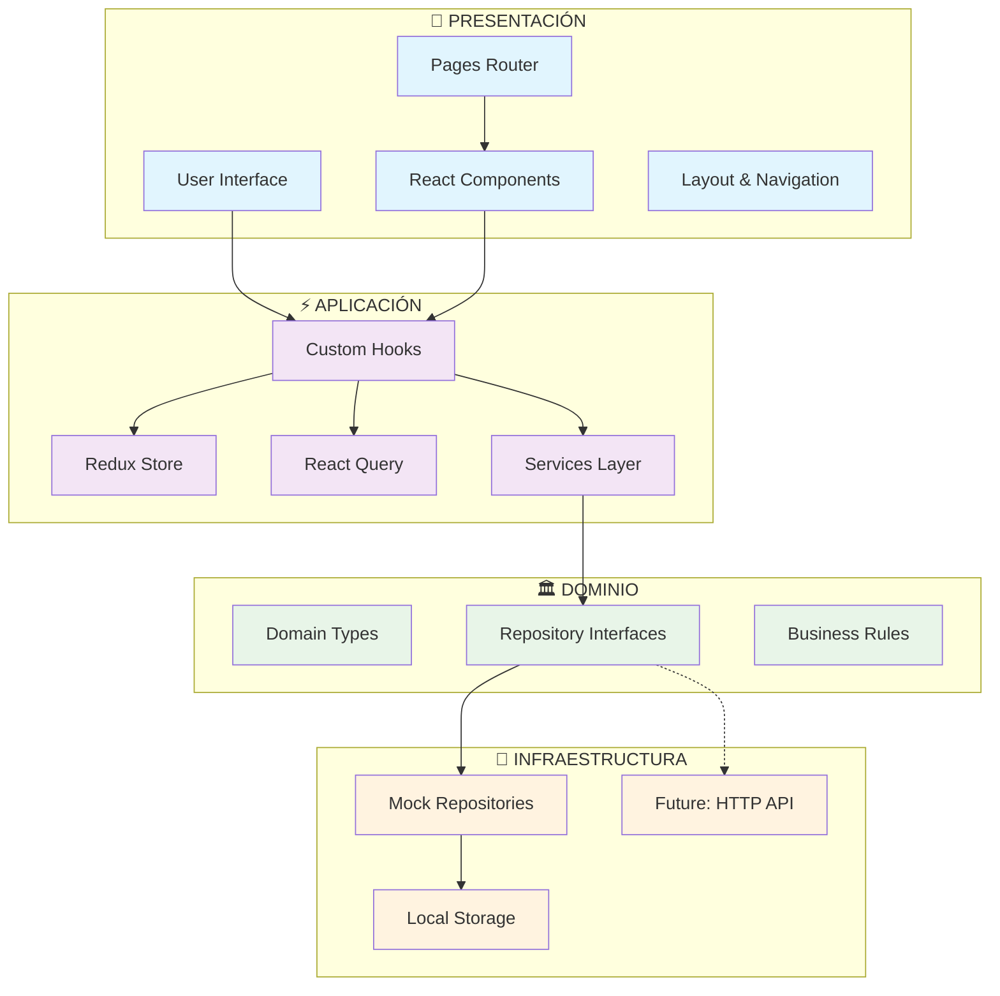
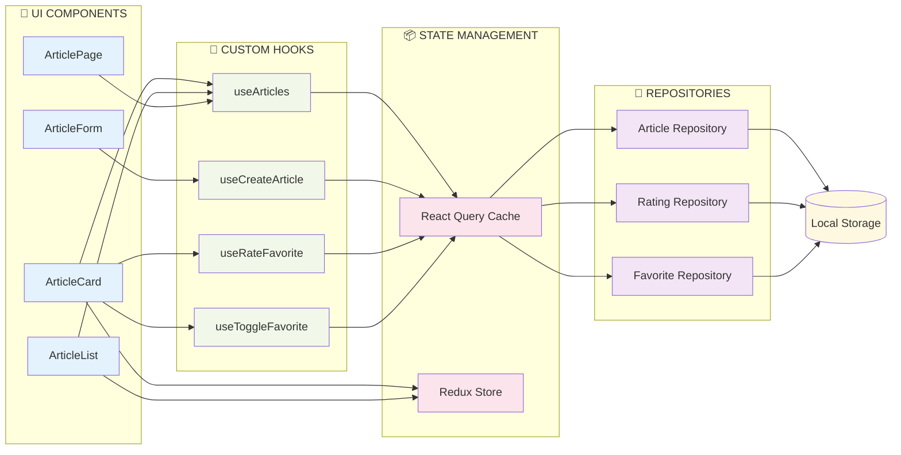
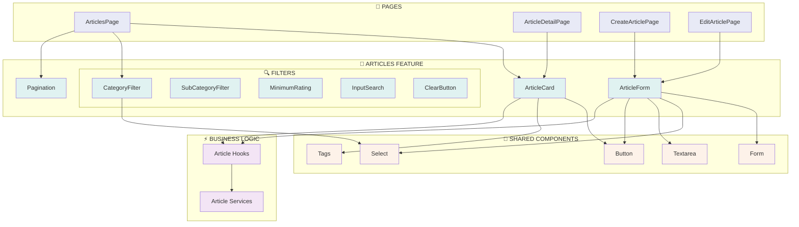
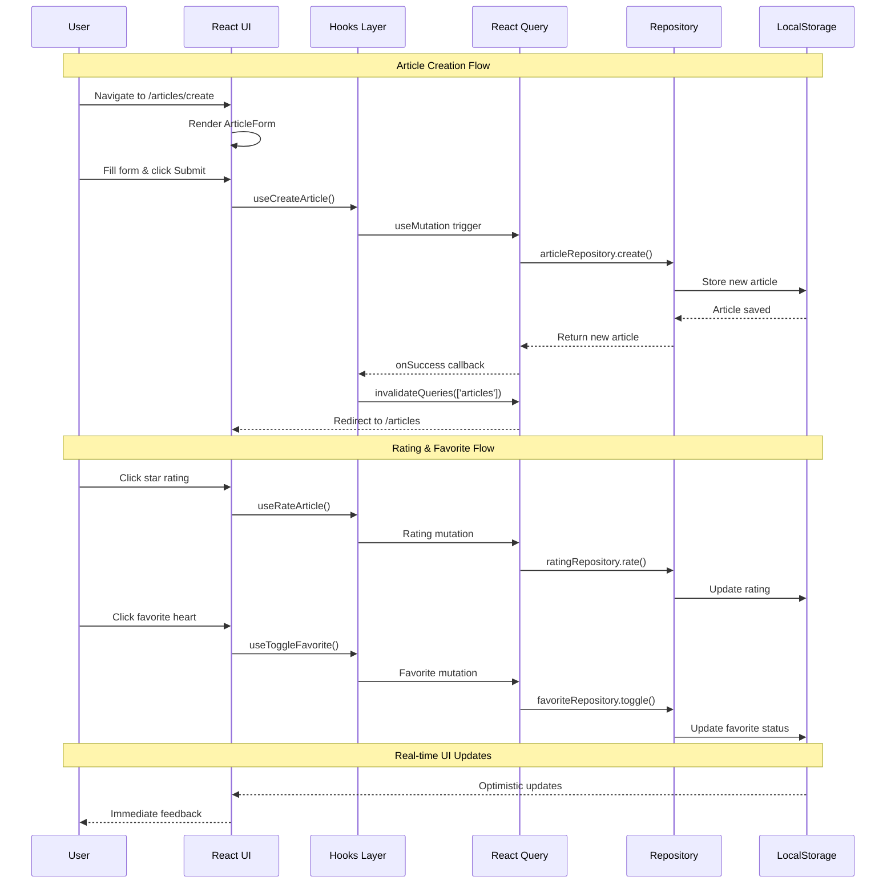

# Documentación del Sistema de Gestión de Artículos

## Tabla de Contenidos

1. [Descripción General](#descripción-general)
2. [Tecnologías Utilizadas](#tecnologías-utilizadas)
3. [Arquitectura del Proyecto](#arquitectura-del-proyecto)
4. [Estructura de Directorios](#estructura-de-directorios)
5. [Patrones de Diseño](#patrones-de-diseño)
6. [Configuración del Proyecto](#configuración-del-proyecto)
7. [Scripts Disponibles](#scripts-disponibles)
8. [Testing](#testing)
9. [Path Aliases](#path-aliases)
10. [Componentes Principales](#componentes-principales)
11. [Preguntas y Respuestas](#preguntas-y-respuestas)

## Demo

[Demo de la aplicación](https://article-manager-steel.vercel.app/articles)

## ✨ Últimas Actualizaciones

### 🎯 **Sistema de Favoritos Completo** (v2.0)

- **FavoritesPage**: Página dedicada para gestionar artículos favoritos con estado vacío elegante
- **Navegación integrada**: Link "Favorites" en el header con navegación consistente
- **Sincronización en tiempo real**: Estado optimista con React Query para mejor UX
- **Persistencia**: Favoritos guardados en LocalStorage con sincronización automática
- **Tests comprehensivos**: 15/15 tests unitarios incluyendo integración de favoritos

### 🔧 **Validación de Formularios Mejorada** (v1.9)

- **HTML5 Validation**: Atributos `required` en todos los campos obligatorios
- **Accesibilidad mejorada**: IDs únicos y labels apropiados para lectores de pantalla
- **E2E Testing**: Tests de validación que verifican comportamiento de formularios
- **UX consistente**: Validación uniforme en crear y editar artículos

### 🎨 **Mejoras de UI/UX** (v1.8)

- **Componentes Button consistentes**: Navegación estandarizada con componentes reutilizables
- **Animaciones optimizadas**: EnterAnimation aplicada a cards individuales para mejor performance
- **Routing SPA**: Configuración Vercel para manejar rutas del lado del cliente
- **Deployment listo**: Configuración completa para producción en Vercel

## Descripción General

El Sistema de Gestión de Artículos es una aplicación web desarrollada con React que permite a los usuarios gestionar artículos con funcionalidades como:

- ✅ Crear, editar y eliminar artículos
- ⭐ Sistema de calificaciones (1-5 estrellas)
- ❤️ **Marcar artículos como favoritos** con página dedicada
- 🔍 Filtrado avanzado por categoría, subcategoría, calificación mínima
- 📱 Interfaz responsive con Tailwind CSS
- 🧪 Testing completo (unitario, integración, E2E)
- ✅ **Validación de formularios HTML5** para mejor experiencia de usuario
- 🎨 **Navegación mejorada** con componentes Button consistentes

## Tecnologías Utilizadas

### Frontend Core

- **React 19.1.1** - Framework principal
- **TypeScript 5.9.3** - Tipado estático
- **Vite 7.1.7** - Build tool y dev server
- **Node.js 22**

### Gestión de Paquetes

- **Bun** (recomendado) - Runtime y gestor ultra-rápido
- **npm** (alternativo) - Gestor tradicional de Node.js

### Gestión de Estado

- **Redux Toolkit 2.9.0** - Estado global (UI state)
- **React Query 5.90.2** - Estado del servidor y cache

### Estilos

- **Tailwind CSS 4.1.14** - Framework de CSS
- **Lucide React** - Iconografía

### Testing

- **Vitest** - Testing unitario e integración
- **Cypress** - Testing E2E
- **Testing Library** - Utilidades de testing

### Animaciones

- **Motion (Framer Motion) 12.23.24** - Animaciones y transiciones

## Arquitectura del Proyecto

El proyecto sigue una **Arquitectura Hexagonal (Ports & Adapters)** combinada con un enfoque de **Vertical Slice Architecture**, organizando el código en capas bien definidas:

### Diagrama de Arquitectura del Sistema



### Diagrama de Flujo de Datos - Gestión de Estado



### Diagrama de Componentes - Feature Articles



### Capas Arquitectónicas

```
┌─────────────────────────────────────┐
│           PRESENTACIÓN              │
│    (Components, Pages, Hooks)       │
├─────────────────────────────────────┤
│            APLICACIÓN               │
│      (Services, Store, Query)       │
├─────────────────────────────────────┤
│             DOMINIO                 │
│    (Types, Interfaces, Rules)       │
├─────────────────────────────────────┤
│         INFRAESTRUCTURA            │
│   (Repositories, External APIs)     │
└─────────────────────────────────────┘
```

### Principios de Diseño

1. **Inversión de Dependencias**: El dominio define interfaces que la infraestructura implementa
2. **Separación de Responsabilidades**: Cada capa tiene una responsabilidad específica
3. **Vertical Slices**: Funcionalidades agrupadas por dominio (articles, categories)
4. **Testabilidad**: Arquitectura que facilita el testing en todos los niveles

## Estructura de Directorios

```
src/
├── application/           # Capa de Aplicación
│   ├── hooks/            # Redux hooks personalizados
│   ├── store/            # Configuración de Redux
│   └── queryClient.ts    # Configuración React Query
│
├── domain/               # Capa de Dominio
│   ├── repositories.ts   # Interfaces de repositorios
│   └── types.ts         # Types del dominio
│
├── infrastructure/       # Capa de Infraestructura
│   └── repositories/    # Implementaciones de repositorios
│       ├── MockArticleRepository.ts
│       ├── MockRatingRepository.ts
│       └── MockFavoriteRepository.ts
│
├── features/            # Vertical Slices por Feature
│   └── articles/
│       ├── components/  # Componentes específicos
│       ├── hooks/      # Hooks del dominio
│       ├── services/   # Servicios e inyección
│       └── __tests__/  # Tests del feature
│
├── pages/              # Páginas de la aplicación
│   ├── articles/
│   └── categories/
│   └── categories/
│
├── shared/             # Código compartido
│   ├── components/     # Componentes reutilizables
│   ├── constants/      # Constantes globales
│   ├── types/         # Types compartidos
│   └── utils/         # Utilidades
│
└── components/         # Layout y componentes de app
```

## Gestión de Estado: Redux vs React Query

### Separación de Responsabilidades

Este proyecto implementa una **estrategia híbrida** de gestión de estado que separa claramente las responsabilidades entre Redux Toolkit y React Query:

#### 🏪 **Redux Toolkit - Estado de la UI/Cliente**

```typescript
// src/application/store/uiSlice.ts
interface UIState {
  theme: 'light' | 'dark'; // Tema seleccionado por el usuario
  isLoading: boolean; // Estados de carga globales
  error: string | null; // Errores globales de la UI
  currentPage: string; // Página actual para navegación
}
```

**¿Qué maneja Redux?**

- ✅ **Configuración de UI**: tema, idioma, preferencias
- ✅ **Estado de navegación**: página actual, breadcrumbs
- ✅ **Estados globales**: loading spinners, notificaciones
- ✅ **Datos que persisten entre páginas**: configuración del usuario

**¿Por qué Redux para estos datos?**

- 🎯 **Inmediatez**: Cambios instantáneos sin llamadas al servidor
- 🔄 **Persistencia**: Se mantiene durante toda la sesión
- 🌍 **Acceso global**: Cualquier componente puede acceder
- 📱 **Estado de UI**: No depende de datos del servidor

#### ⚡ **React Query - Estado del Servidor**

```typescript
// src/features/articles/hooks/index.ts

// Datos del servidor con cache inteligente
export const useArticles = (filters: ArticleFilters) => {
  return useQuery({
    queryKey: ['articles', filters], // Cache por filtros
    queryFn: () => articleRepository.findAll(filters),
    staleTime: 5 * 60 * 1000, // 5 minutos fresh
  });
};

// Mutaciones con invalidación automática
export const useCreateArticle = () => {
  return useMutation({
    mutationFn: (data) => articleRepository.create(data),
    onSuccess: () => {
      queryClient.invalidateQueries(['articles']); // Refresca cache
    },
  });
};
```

**¿Qué maneja React Query?**

- 📊 **Datos del servidor**: artículos, ratings, favoritos
- 🔄 **Cache inteligente**: evita peticiones innecesarias
- ⚡ **Sincronización**: mantiene datos actualizados
- 🔄 **Mutaciones**: CREATE, UPDATE, DELETE con invalidación

**¿Por qué React Query para estos datos?**

- 🚀 **Performance**: Cache optimizado y stale-while-revalidate
- 🔄 **Sincronización**: Invalidación automática tras mutaciones
- ⚡ **UX mejorada**: Loading states, error handling, retry automático
- 🎯 **Menos boilerplate**: No necesita actions/reducers para cada endpoint

### Comparación Práctica

#### ❌ **Antipatrón**: Todo en Redux

```typescript
// MAL - Artículos en Redux
const articlesSlice = createSlice({
  name: 'articles',
  initialState: { articles: [], loading: false, error: null },
  reducers: {
    fetchArticlesStart: (state) => {
      state.loading = true;
    },
    fetchArticlesSuccess: (state, action) => {
      state.articles = action.payload;
      state.loading = false;
    },
    // ... mucho boilerplate
  },
});
```

#### ✅ **Patrón Correcto**: Separación de Responsabilidades

```typescript
// BIEN - UI State en Redux
const uiSlice = createSlice({
  name: 'ui',
  reducers: {
    setTheme: (state, action) => {
      state.theme = action.payload;
    },
  },
});

// BIEN - Server State en React Query
const useArticles = () =>
  useQuery({
    queryKey: ['articles'],
    queryFn: fetchArticles,
    // Cache, retry, background updates automáticos
  });
```

### Flujo de Datos

```
┌─────────────────────────────────────────┐
│                 UI LAYER                │
│  Components consume state via hooks     │
└─────────────────┬───────────────────────┘
                  │
         ┌────────▼──────────┐
         │   HOOK LAYER      │
         │ useSelector()     │  useQuery()
         │ useDispatch()     │  useMutation()
         └────────┬──────────┘
                  │
    ┌─────────────▼─────────────┐
    │      STATE MANAGERS       │
    │                           │
┌───▼────┐              ┌─────▼─────┐
│ REDUX  │              │   REACT   │
│        │              │   QUERY   │
│ • UI   │              │ • Server  │
│ • Nav  │              │ • Cache   │
│ • Prefs│              │ • Sync    │
└────────┘              └───────────┘
```

### Ventajas de esta Arquitectura

1. **🎯 Separación Clara**: Cada herramienta para su propósito específico
2. **⚡ Performance**: Cache optimizado para datos del servidor
3. **🔧 Mantenibilidad**: Menos código para manejar server state
4. **🎭 UX Superior**: Loading/error states automáticos
5. **🧪 Testing**: Más fácil mockear datos del servidor
6. **📈 Escalabilidad**: Fácil agregar nuevos endpoints

Esta separación permite que cada herramienta haga lo que mejor sabe hacer, resultando en código más limpio, mejor performance y una experiencia de desarrollo superior.

## 🚀 Deployment y Configuración de Producción

### Vercel Deployment

El proyecto está configurado y desplegado en **Vercel** con las siguientes optimizaciones:

#### Configuración SPA (Single Page Application)

```json
// vercel.json
{
  "rewrites": [{ "source": "/(.*)", "destination": "/index.html" }]
}
```

**¿Por qué esta configuración?**

- ✅ **Routing del lado del cliente**: React Router maneja todas las rutas
- ✅ **Recarga de página**: URLs como `/favorites` funcionan al recargar
- ✅ **404 Prevention**: Evita errores 404 en rutas del SPA
- ✅ **SEO-friendly**: Todas las rutas devuelven el HTML principal

#### Build & Deploy Pipeline

```bash
# Build automático en Vercel
npm run build          # Genera build optimizado
npm run preview         # Preview local del build
```

#### Environment Configuration

```bash
# Variables de entorno para producción
VITE_API_URL=https://api.example.com    # URL de API (futuro)
VITE_APP_NAME=Article Manager           # Nombre de la aplicación
```

#### Performance Optimizations

- **Vite**: Build ultra-rápido con tree-shaking automático
- **Code Splitting**: Chunks optimizados por ruta
- **Static Assets**: Optimización automática de imágenes y CSS
- **CDN**: Distribución global automática en Vercel Edge Network

## Patrones de Diseño

### 1. Repository Pattern

```typescript
// Domain - Interface
export interface ArticleRepository {
  findAll(filters: ArticleFilters): Promise<PaginatedResponse<Article>>;
  findById(id: string): Promise<Article | null>;
  create(
    article: Omit<Article, 'id' | 'createdAt' | 'updatedAt'>
  ): Promise<Article>;
}

// Infrastructure - Implementation
export class MockArticleRepository implements ArticleRepository {
  // Implementación específica
}
```

### 2. Dependency Injection

```typescript
// Services layer - Inyección de dependencias
export const articleRepository = new MockArticleRepository();
export const ratingRepository = new MockRatingRepository();
```

### 3. Custom Hooks Pattern

```typescript
// Encapsulación de lógica de negocio
export const useToggleFavorite = () => {
  return useMutation({
    mutationFn: async ({ articleId, isFavorite }: ToggleFavoriteParams) => {
      // Lógica de negocio
    },
  });
};
```

### 4. Component Composition

```typescript
// Componentes compuestos y reutilizables
<ArticleFilter>
  <ArticleCategoryFilter />
  <ArticleMinimumRating />
  <ArticleFiltersInputSearch />
</ArticleFilter>
```

## Instalación y Configuración

### Requisitos del Sistema

- **Node.js 22** - Versión requerida para ejecutar el proyecto
- **Bun** (recomendado) o **npm** - Gestor de paquetes

### Proceso de Instalación

1. **Instalar Node.js en su versión 22**
   - Descargar desde [nodejs.org](https://nodejs.org/)
   - Verificar instalación: `node --version`

2. **Instalar dependencias**

   ```bash
   # Con Bun (recomendado)
   bun install

   # Con npm (alternativo)
   npm install
   ```

3. **Ejecutar el proyecto**

   ```bash
   # Con Bun
   bun run dev

   # Con npm
   npm run dev
   ```

   La aplicación estará disponible en `http://localhost:5173`

### Path Aliases

El proyecto utiliza path aliases para importaciones más limpias:

```typescript
// vite.config.ts & tsconfig.json
"@": "./src"
"@components": "./src/shared/components"
"@features": "./src/features"
"@pages": "./src/pages"
"@hooks": "./src/shared/hooks"
"@utils": "./src/shared/utils"
"@types": "./src/shared/types"
```

### Variables de Entorno

```bash
# .env example
VITE_API_URL=http://localhost:3000/api
VITE_APP_NAME=Gestión de Artículos
```

### Configuración de Archivos Lock

El proyecto mantiene ambos archivos de lock para flexibilidad:

```bash
bun.lock          # Lock file de Bun (binario)
package-lock.json # Lock file de npm (JSON)
```

**Recomendación**: Usar Bun para desarrollo debido a su velocidad superior, pero mantener compatibilidad con npm para CI/CD y equipos que prefieran npm.

## Gestión de Paquetes

Este proyecto soporta tanto **Bun** como **npm** como gestores de paquetes:

- 📦 **Bun** (recomendado): Runtime y gestor de paquetes ultra-rápido
- 📦 **npm**: Gestor de paquetes tradicional de Node.js

### Instalación de Dependencias

```bash
# Con Bun (recomendado - más rápido)
bun install

# Con npm (alternativo)
npm install
```

## Scripts Disponibles

### Con Bun (Recomendado)

```bash
# Desarrollo
bun dev              # Servidor de desarrollo
bun run build        # Build de producción
bun run preview      # Preview del build

# Code Quality
bun run lint         # Linting con ESLint
bun run lint:fix     # Fix automático
bun run format       # Formateo con Prettier

# Testing
bun test             # Tests unitarios (watch mode)
bun run test:run     # Tests unitarios (single run)
bun run test:ui      # UI de Vitest
bun run cypress:open # Cypress en modo interactivo
bun run cypress:run  # Cypress en modo headless
```

### Con npm (Alternativo)

```bash
# Desarrollo
npm run dev          # Servidor de desarrollo
npm run build        # Build de producción
npm run preview      # Preview del build

# Code Quality
npm run lint         # Linting con ESLint
npm run lint:fix     # Fix automático
npm run format       # Formateo con Prettier

# Testing
npm run test         # Tests unitarios (watch mode)
npm run test:run     # Tests unitarios (single run)
npm run test:ui      # UI de Vitest
npm run cypress:open # Cypress en modo interactivo
npm run cypress:run  # Cypress en modo headless
```

### ⚡ Ventajas de Bun

- **🚀 Velocidad**: Hasta 25x más rápido que npm en instalación
- **🔋 Runtime nativo**: JavaScript/TypeScript runtime construido desde cero
- **📦 Todo en uno**: Bundler, test runner, y package manager integrados
- **⚡ Hot reload**: Recarga instantánea en desarrollo
- **🎯 Compatibilidad**: 100% compatible con Node.js y npm

## Testing

### Estrategia de Testing

#### 1. Tests Unitarios (Vitest + Testing Library)

```typescript
// Componentes aislados
describe('ArticleCard', () => {
  test('displays article information correctly', () => {
    render(<ArticleCard article={mockArticle} />);
    expect(screen.getByText(mockArticle.title)).toBeInTheDocument();
  });
});

// Tests de integración de favoritos
describe('FavoritesIntegration', () => {
  test('should toggle favorite status and sync with server state', async () => {
    // Test completo de funcionalidad de favoritos
  });
});
```

#### 2. Tests de Integración

```typescript
// Flujos completos de funcionalidades
test('creates and displays new article', async () => {
  // Test del flujo completo
});
```

#### 3. Tests E2E (Cypress)

```typescript
// cypress/e2e/article-happy-path.cy.ts
describe('Article Management Happy Path', () => {
  it('should complete full article lifecycle', () => {
    cy.visit('/articles');
    cy.get('[data-testid="create-article"]').click();
    // Test del flujo completo del usuario
  });
});
```

### Diagrama de Estrategia de Testing

```mermaid
pyramid
    title Testing Strategy Pyramid

    %% E2E Tests (Top)
    section E2E Tests
        "Cypress E2E" : 15
        "User Workflows" : 10
        "Happy Paths" : 8

    %% Integration Tests (Middle)
    section Integration Tests
        "Feature Tests" : 25
        "Hook Integration" : 20
        "Component Integration" : 15

    %% Unit Tests (Base)
    section Unit Tests
        "Component Tests" : 40
        "Hook Tests" : 35
        "Utility Tests" : 30
        "Repository Tests" : 25
```

### Flujo E2E - Article Lifecycle



### Coverage y Calidad

- **Cobertura actual**: 15/15 tests unitarios passing (100%)
- **Tests por feature**: Unitarios + Integración + E2E
- **Mocking**: Repositorios mockeados para testing
- **E2E Validation**: Tests específicos para validación de formularios
- **Accesibilidad**: Validación de IDs únicos y labels apropiados

## Path Aliases

El proyecto utiliza path aliases configurados tanto en Vite como en TypeScript:

### Antes (rutas relativas)

```typescript
import { Article } from '../../../shared/types';
import { Button } from '../../../shared/components/Button';
```

### Después (path aliases)

```typescript
import { Article } from '@types';
import { Button } from '@components/Button';
```

## Componentes Principales

### ArticleCard

- **Ubicación**: `src/features/articles/components/ArticleCard/`
- **Funcionalidad**: Muestra información del artículo con acciones
- **Features**: Rating, favoritos, edición, eliminación

### ArticleForm

- **Ubicación**: `src/features/articles/components/ArticleForm/`
- **Funcionalidad**: Formulario para crear/editar artículos
- **Validación**: TypeScript + validación personalizada

### ArticleFilters

- **Ubicación**: `src/features/articles/components/ArticleFilter/`
- **Funcionalidad**: Filtrado avanzado de artículos
- **Componentes**: Categoría, subcategoría, rating mínimo, búsqueda

### Pagination

- **Ubicación**: `src/features/articles/components/Pagination/`
- **Funcionalidad**: Paginación de resultados
- **Features**: Navegación, info de página actual

### FavoritesPage

- **Ubicación**: `src/pages/favorites/FavoritesPage.tsx`
- **Funcionalidad**: Página dedicada para mostrar artículos favoritos
- **Features**: Estado vacío elegante, grid responsivo, navegación a artículos
- **Hooks**: `useFavorites()` para gestión de estado de favoritos

### Layout con Navegación Mejorada

- **Ubicación**: `src/components/Layout.tsx`
- **Funcionalidad**: Layout principal con navegación consistente
- **Features**: Botones estilizados, navegación responsive, dropdown de categorías
- **Componentes**: Utiliza componentes Button para consistencia visual

## Preguntas y Respuestas

### Arquitectura y Organización

#### ¿Cómo se implementa el enfoque Vertical Slice en este proyecto?

El proyecto implementa **Vertical Slice Architecture** organizando el código por features/dominios en lugar de por capas técnicas:

```
features/
└── articles/                    # Slice vertical completo
    ├── components/             # UI específica del dominio
    │   ├── ArticleCard/
    │   ├── ArticleForm/
    │   └── ArticleFilters/
    ├── hooks/                  # Lógica de negocio del dominio
    │   ├── useArticles.ts
    │   ├── useToggleFavorite.ts
    │   └── useRateArticle.ts
    ├── services/              # Servicios e inyección de dependencias
    │   └── index.ts
    └── __tests__/             # Tests específicos del feature
        ├── ArticleForm.test.tsx
        └── ArticleIntegration.test.tsx
```

**Ventajas de este enfoque:**

- 🎯 **Cohesión alta**: Todo lo relacionado con articles está junto
- 🔄 **Acoplamiento bajo**: Cada feature es independiente
- 🧪 **Testing facilitado**: Tests específicos por dominio
- 👥 **Colaboración mejorada**: Equipos pueden trabajar en features independientes

#### ¿Cómo se justifican las decisiones arquitectónicas inspiradas en Arquitectura Hexagonal?

La **Arquitectura Hexagonal** se implementa a través de tres capas principales:

##### 1. **Dominio (Core Business Logic)**

```typescript
// src/domain/repositories.ts
export interface ArticleRepository {
  findAll(filters: ArticleFilters): Promise<PaginatedResponse<Article>>;
  findById(id: string): Promise<Article | null>;
  create(article: CreateArticleRequest): Promise<Article>;
}
```

- **Responsabilidad**: Define las reglas de negocio y contratos
- **Sin dependencias**: No conoce detalles de implementación
- **Estable**: Cambia solo cuando cambian las reglas de negocio

##### 2. **Aplicación (Use Cases & Orchestration)**

```typescript
// src/features/articles/hooks/index.ts
export const useCreateArticle = () => {
  return useMutation({
    mutationFn: (article: CreateArticleRequest) =>
      articleRepository.create(article),
    onSuccess: () => {
      queryClient.invalidateQueries(['articles']);
    },
  });
};
```

- **Responsabilidad**: Orquesta casos de uso y coordina el flujo
- **Depende del dominio**: Usa interfaces definidas en el dominio
- **Independiente de UI**: No conoce React o componentes específicos

##### 3. **Infraestructura (External Adapters)**

```typescript
// src/infrastructure/repositories/MockArticleRepository.ts
export class MockArticleRepository implements ArticleRepository {
  private articles: Article[] = [];

  async findAll(filters: ArticleFilters): Promise<PaginatedResponse<Article>> {
    // Implementación específica con datos mock
  }
}
```

- **Responsabilidad**: Implementa los contratos del dominio
- **Adaptadores**: Puede ser Mock, HTTP API, Database, etc.
- **Intercambiable**: Se puede cambiar sin afectar el dominio

#### ¿Cómo se separa la lógica de negocio de los adaptadores?

La separación se logra a través del **patrón Repository** y **Dependency Injection**:

##### **1. Definición de Contratos (Dominio)**

```typescript
// domain/repositories.ts - Puerto (Port)
export interface ArticleRepository {
  findAll(filters: ArticleFilters): Promise<PaginatedResponse<Article>>;
}

export interface RatingRepository {
  rateArticle(articleId: string, rating: number): Promise<void>;
}
```

##### **2. Implementación de Adaptadores (Infraestructura)**

```typescript
// infrastructure/repositories/ - Adaptadores (Adapters)

// Adaptador para datos Mock
export class MockArticleRepository implements ArticleRepository {
  async findAll(filters: ArticleFilters) {
    return this.mockData.filter(/* lógica de filtrado */);
  }
}

// Adaptador para API HTTP (futuro)
export class HttpArticleRepository implements ArticleRepository {
  async findAll(filters: ArticleFilters) {
    return axios.get('/api/articles', { params: filters });
  }
}

// Adaptador para IndexedDB (futuro)
export class IndexedDBArticleRepository implements ArticleRepository {
  async findAll(filters: ArticleFilters) {
    return this.db.articles.where(filters).toArray();
  }
}
```

##### **3. Inyección de Dependencias (Aplicación)**

```typescript
// features/articles/services/index.ts
import { MockArticleRepository } from '@/infrastructure/repositories/MockArticleRepository';

// Inyección - Se puede cambiar fácilmente
export const articleRepository = new MockArticleRepository();

// En producción podría ser:
// export const articleRepository = new HttpArticleRepository();
// export const articleRepository = new IndexedDBArticleRepository();
```

##### **4. Uso en la Aplicación (Sin conocer la implementación)**

```typescript
// features/articles/hooks/index.ts
import { articleRepository } from '../services'; // No sabe qué implementación es

export const useArticles = (filters: ArticleFilters) => {
  return useQuery({
    queryKey: ['articles', filters],
    queryFn: () => articleRepository.findAll(filters), // Usa el contrato, no la implementación
  });
};
```

#### **Beneficios de esta Separación:**

1. **🔄 Intercambiabilidad**: Cambiar de Mock a API real sin tocar lógica de negocio
2. **🧪 Testabilidad**: Mock repositories para tests rápidos
3. **📦 Independencia**: Lógica de negocio independiente de tecnologías externas
4. **🚀 Evolución**: Fácil migración entre diferentes tecnologías de persistencia
5. **👥 Colaboración**: Backend y Frontend pueden desarrollarse independientemente

#### **Ejemplo Práctico de Cambio:**

```typescript
// Desarrollo (Mock)
const articleRepository = new MockArticleRepository();

// Producción (API)
const articleRepository = new HttpArticleRepository(process.env.VITE_API_URL);

// Testing (In-Memory)
const articleRepository = new InMemoryArticleRepository();
```

La aplicación funciona igual independientemente de la implementación, demostrando la efectividad de la separación entre lógica de negocio y adaptadores.

---

## Conclusión

Este proyecto demuestra una implementación sólida de principios arquitectónicos modernos, combinando Vertical Slice Architecture con Arquitectura Hexagonal para crear una base de código mantenible, testeable y escalable.

La separación clara entre dominio, aplicación e infraestructura, junto con el uso de TypeScript y herramientas modernas, proporciona una base robusta para el desarrollo de aplicaciones React empresariales.
