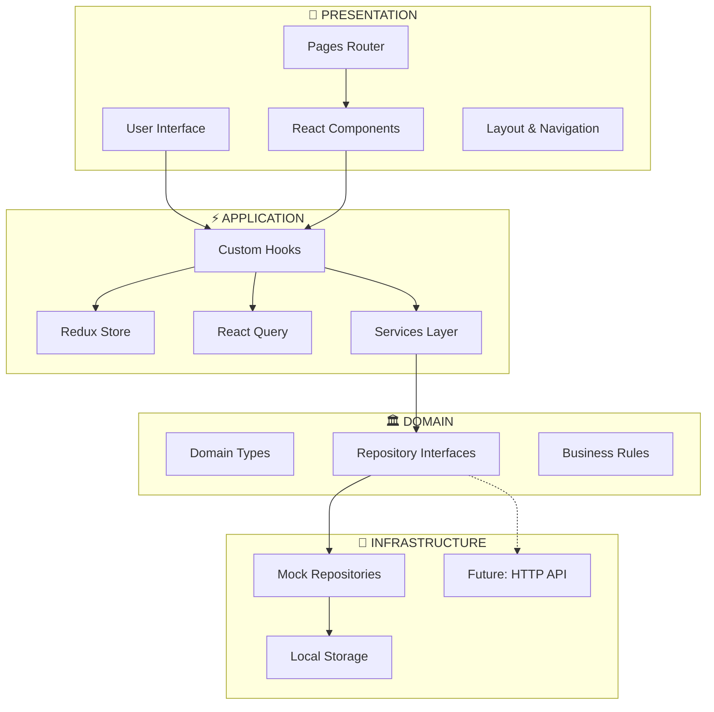

# Article Management System

<div align="center">


**[🚀 Live Demo](https://article-manager-steel.vercel.app/articles)**

</div>

## 🌐 Available Languages

- **English** - [README.md](./README.md) (current)
- **Español** - [README.es.md](./README.es.md)

---

## Table of Contents

1. [Overview](#overview)
2. [Latest Updates](#latest-updates)
3. [Technologies Used](#technologies-used)
4. [Project Architecture](#project-architecture)
5. [Directory Structure](#directory-structure)
6. [State Management](#state-management)
7. [Installation & Setup](#installation--setup)
8. [Available Scripts](#available-scripts)
9. [Testing Strategy](#testing-strategy)
10. [Deployment](#deployment)
11. [Key Components](#key-components)
12. [FAQ](#faq)

## Overview

The Article Management System is a modern React web application that allows users to manage articles with comprehensive features:

- ✅ **CRUD Operations**: Create, edit, and delete articles
- ⭐ **Rating System**: 1-5 star rating functionality
- ❤️ **Favorites System**: Mark articles as favorites with dedicated page
- 🔍 **Advanced Filtering**: Filter by category, subcategory, minimum rating, search
- 📱 **Responsive Design**: Mobile-first approach with Tailwind CSS
- 🧪 **Complete Testing**: Unit, integration, and E2E testing coverage
- 🎨 **Modern UI/UX**: Smooth animations and intuitive navigation
- 🔧 **HTML5 Validation**: Enhanced form validation for better UX

## Latest Updates

### 🔧 **TypeScript & Test Fixes** (v2.2)

- **Problem**: TypeScript null/undefined issues in ArticleDetailPage + 2 failing tests in FavoritesIntegration
- **Root Cause**: Callback defined before null checks; FavoritesPage showing CardExamples instead of MessageNoFavorites
- **Solution**: Restructured component flow with proper type guards; Fixed favorites empty state logic
- **Impact**: Clean TypeScript compilation, all 15/15 tests passing
- **Files Updated**:
  - `src/pages/articles/ArticleDetailPage.tsx` - Enhanced null handling and type safety
  - `src/pages/favorites/FavoritesPage.tsx` - Corrected empty state display logic

### 🐛 **Category Filters Bug Fix** (v2.1)

- **Problem**: Category filters (technology, business, science) weren't applying immediately
- **Root Cause**: Missing synchronization between URL parameters and local filter state
- **Solution**: Implemented `useEffect` for automatic filter synchronization
- **Impact**: Instant filter application with improved user experience
- **Files Updated**: `src/pages/categories/CategoriesPage.tsx`

### 🎯 **Complete Favorites System** (v2.0)

- **FavoritesPage**: Dedicated page with elegant empty state design
- **Navigation Integration**: Consistent "Favorites" link in header
- **Real-time Sync**: Optimistic updates with React Query
- **Persistence**: LocalStorage integration with automatic sync
- **Test Coverage**: Comprehensive 15/15 unit tests including favorites

### 🔧 **Enhanced Form Validation** (v1.9)

- **HTML5 Validation**: Required attributes on mandatory fields
- **Accessibility**: Unique IDs and proper labels for screen readers
- **E2E Testing**: Form validation behavior verification
- **UX Consistency**: Uniform validation across all forms

## Technologies Used

### Core Frontend

- **React 19.1.1** - Modern UI library
- **TypeScript 5.9.3** - Static type checking
- **Vite 7.1.7** - Fast build tool and dev server
- **Node.js 22** - Runtime environment

### Package Management

- **Bun** (recommended) - Ultra-fast runtime and package manager
- **npm** (alternative) - Traditional Node.js package manager

### State Management

- **Redux Toolkit 2.9.0** - Global UI state management
- **React Query 5.90.2** - Server state and caching

### Styling & UI

- **Tailwind CSS 4.1.14** - Utility-first CSS framework
- **Lucide React** - Beautiful icons
- **Motion (Framer Motion) 12.23.24** - Smooth animations

### Testing

- **Vitest** - Unit and integration testing
- **Cypress** - End-to-end testing
- **Testing Library** - React component testing utilities

## Project Architecture

This project implements **Hexagonal Architecture (Ports & Adapters)** combined with **Vertical Slice Architecture** for maximum maintainability and scalability.

### Architecture Diagram



### Architectural Layers

```
┌─────────────────────────────────────┐
│           PRESENTATION              │
│    (Components, Pages, Hooks)       │
├─────────────────────────────────────┤
│            APPLICATION              │
│      (Services, Store, Query)       │
├─────────────────────────────────────┤
│             DOMAIN                  │
│    (Types, Interfaces, Rules)       │
├─────────────────────────────────────┤
│         INFRASTRUCTURE             │
│   (Repositories, External APIs)     │
└─────────────────────────────────────┘
```

## State Management

### Redux vs React Query Strategy

The project uses a **hybrid approach** that clearly separates responsibilities:

#### 🏪 **Redux Toolkit - UI/Client State**

**What Redux manages:**

- ✅ UI configuration: theme, language, preferences
- ✅ Navigation state: current page, breadcrumbs
- ✅ Global states: loading spinners, notifications
- ✅ Data that persists across pages: user configuration

#### ⚡ **React Query - Server State**

**What React Query manages:**

- 📊 Server data: articles, ratings, favorites
- 🔄 Intelligent caching: avoids unnecessary requests
- ⚡ Synchronization: keeps data up-to-date
- 🔄 Mutations: CREATE, UPDATE, DELETE with cache invalidation

### Benefits of This Architecture

1. **🎯 Clear Separation**: Each tool for its specific purpose
2. **⚡ Performance**: Optimized cache for server data
3. **🔧 Maintainability**: Less boilerplate for server state
4. **🎭 Superior UX**: Automatic loading/error states
5. **🧪 Testing**: Easier to mock server data
6. **📈 Scalability**: Easy to add new endpoints

## Directory Structure

```
src/
├── application/           # Application Layer
│   ├── hooks/            # Custom Redux hooks
│   ├── store/            # Redux configuration
│   └── queryClient.ts    # React Query setup
│
├── domain/               # Domain Layer
│   ├── repositories.ts   # Repository interfaces
│   └── types.ts         # Domain types
│
├── infrastructure/       # Infrastructure Layer
│   └── repositories/    # Repository implementations
│       ├── MockArticleRepository.ts
│       ├── MockRatingRepository.ts
│       └── MockFavoriteRepository.ts
│
├── features/            # Vertical Slices by Feature
│   └── articles/
│       ├── components/  # Feature-specific components
│       ├── hooks/      # Domain hooks
│       ├── services/   # Services & injection
│       └── __tests__/  # Feature tests
│
├── pages/              # Application pages
│   ├── articles/
│   ├── categories/
│   └── favorites/
│
├── shared/             # Shared code
│   ├── components/     # Reusable components
│   ├── constants/      # Global constants
│   ├── types/         # Shared types
│   └── utils/         # Utilities
│
└── components/         # Layout & app components
```

## Installation & Setup

### System Requirements

- **Node.js 22** - Required runtime version
- **Bun** (recommended) or **npm** - Package manager

### Installation Process

1. **Install Node.js version 22**
   - Download from [nodejs.org](https://nodejs.org/)
   - Verify installation: `node --version`

2. **Install dependencies**

   ```bash
   # With Bun (recommended)
   bun install

   # With npm (alternative)
   npm install
   ```

3. **Run the project**

   ```bash
   # With Bun
   bun run dev

   # With npm
   npm run dev
   ```

   The application will be available at `http://localhost:5173`

## Available Scripts

### With Bun (Recommended)

```bash
# Development
bun dev              # Development server
bun run build        # Production build
bun run preview      # Preview build

# Code Quality
bun run lint         # ESLint
bun run lint:fix     # Auto-fix
bun run format       # Prettier formatting

# Testing
bun test             # Unit tests (watch mode)
bun run test:run     # Unit tests (single run)
bun run test:ui      # Vitest UI
bun run cypress:open # Cypress interactive
bun run cypress:run  # Cypress headless
```

### With npm (Alternative)

```bash
# Development
npm run dev          # Development server
npm run build        # Production build
npm run preview      # Preview build

# Testing
npm run test         # Unit tests (watch mode)
npm run test:run     # Unit tests (single run)
npm run cypress:open # Cypress interactive
npm run cypress:run  # Cypress headless
```

## Testing Strategy

### Test Coverage: 15/15 ✅

#### 1. Unit Tests (Vitest + Testing Library)

```typescript
describe('ArticleCard', () => {
  test('displays article information correctly', () => {
    render(<ArticleCard article={mockArticle} />);
    expect(screen.getByText(mockArticle.title)).toBeInTheDocument();
  });
});
```

#### 2. Integration Tests

```typescript
describe('FavoritesIntegration', () => {
  test('should toggle favorite and sync with server state', async () => {
    // Complete functionality testing
  });
});
```

#### 3. E2E Tests (Cypress)

```typescript
describe('Article Management Happy Path', () => {
  it('should complete full article lifecycle', () => {
    cy.visit('/articles');
    cy.get('[data-testid="create-article"]').click();
    // Complete user flow testing
  });
});
```

## Deployment

### Vercel Configuration

The project is deployed on **Vercel** with SPA optimization:

```json
// vercel.json
{
  "rewrites": [{ "source": "/(.*)", "destination": "/index.html" }]
}
```

**Benefits:**

- ✅ Client-side routing support
- ✅ Page refresh works on all routes
- ✅ 404 prevention for SPA routes
- ✅ Global CDN distribution

## Key Components

### ArticleCard

- **Location**: `src/features/articles/components/ArticleCard/`
- **Features**: Rating, favorites, edit, delete actions

### ArticleForm

- **Location**: `src/features/articles/components/ArticleForm/`
- **Features**: Create/edit articles with TypeScript validation

### FavoritesPage

- **Location**: `src/pages/favorites/FavoritesPage.tsx`
- **Features**: Dedicated favorites page with elegant empty state

### Layout

- **Location**: `src/components/Layout.tsx`
- **Features**: Consistent navigation with responsive design

## FAQ

### Why Hexagonal Architecture?

**Benefits:**

- 🎯 **Clear separation** between business logic and external concerns
- 🔄 **Easy testing** with mockable dependencies
- 📦 **Technology independence** - can swap implementations
- 🚀 **Maintainability** - changes isolated to specific layers

### Why Redux + React Query?

**Complementary strengths:**

- Redis excels at UI state that doesn't require server sync
- React Query excels at server data with intelligent caching
- Together they provide optimal performance and developer experience

---

## Conclusion

This project demonstrates a solid implementation of modern architectural principles, combining Vertical Slice Architecture with Hexagonal Architecture to create a maintainable, testable, and scalable codebase. The clear separation between domain, application, and infrastructure, along with TypeScript and modern tooling, provides a robust foundation for enterprise React applications.

---

<div align="center">

**Made with ❤️ using React, TypeScript, and Modern Web Technologies**

</div>
