# Sistema de Gestión de Artículos - Arquitectura Hexagonal

## Tabla de Contenidos

1. [Descripción General](#descripción-general)
2. [✨ Últimas Actualizaciones](#últimas-actualizaciones)
3. [Tecnologías Utilizadas](#tecnologías-utilizadas)
4. [Arquitectura Hexagonal](#arquitectura-hexagonal)
5. [Estructura de Directorios](#estructura-de-directorios)
6. [Patrones de Diseño](#patrones-de-diseño)
7. [Instalación y Configuración](#instalación-y-configuración)
8. [Scripts Disponibles](#scripts-disponibles)
9. [Testing](#testing)
10. [Componentes Principales](#componentes-principales)
11. [Preguntas y Respuestas](#preguntas-y-respuestas)

## Demo

[Demo de la aplicación](https://article-manager-steel.vercel.app/articles)

## ✨ Últimas Actualizaciones

### 🏗️ **Refactorización a Arquitectura Hexagonal** (v3.0)

**NUEVA IMPLEMENTACIÓN COMPLETA** - El proyecto ha sido completamente refactorizado hacia una arquitectura hexagonal pura con las siguientes mejoras:

#### 🎯 **Arquitectura Hexagonal Pura**

- **Domain Layer**: Entidades con Domain Driven Design, Value Objects y servicios de dominio
- **Application Layer**: Use Cases específicos y puertos claramente definidos
- **Infrastructure Layer**: Adaptadores para LocalStorage con implementación completa
- **Dependency Injection**: Container de dependencias singleton para inyección limpia

#### 🏛️ **Estructura de Capas Bien Definidas**

```
src/
├── core/                    # 🎯 DOMINIO + APLICACIÓN
│   ├── domain/             # Entidades, Value Objects, Servicios
│   └── application/        # Use Cases, Puertos (Ports)
├── adapters/               # 🔌 ADAPTADORES
│   ├── mappers/           # Transformación de datos
│   └── outbound/          # Persistencia (LocalStorage)
├── configuration/         # 🏗️ INYECCIÓN DE DEPENDENCIAS
└── features/              # 🎨 PRESENTACIÓN
```

#### 🎨 **Nuevas Capacidades**

- **Clean Architecture**: Separación absoluta entre capas con inversión de dependencias
- **Domain Entities**: Article, Category, Rating, Favorite como entidades de dominio
- **Value Objects**: ArticleId, Pagination para encapsular lógica específica
- **Use Cases**: CreateArticleUseCase, GetArticlesUseCase, RateArticleUseCase, etc.
- **Mappers**: Transformación limpia entre dominio y persistencia
- **Ports & Adapters**: Interfaces claramente definidas para todos los componentes

#### 🔧 **Mejoras Técnicas**

- **LocalStorage Repositories**: Implementación completa con persistencia real
- **Domain Services**: ArticleRatingService para lógica de negocio compleja
- **Dependency Container**: Patrón Singleton para manejo centralizado de dependencias
- **Type Safety**: TypeScript estricto en todas las capas
- **Testabilidad**: Arquitectura diseñada para testing comprehensivo

### 🎯 **Sistema de Favoritos Completo** (v2.0)

- **FavoritesPage**: Página dedicada para gestionar artículos favoritos con estado vacío elegante
- **Navegación integrada**: Link "Favorites" en el header con navegación consistente
- **Sincronización en tiempo real**: Estado optimista con React Query para mejor UX
- **Persistencia**: Favoritos guardados en LocalStorage con sincronización automática
- **Tests comprehensivos**: 15/15 tests unitarios incluyendo integración de favoritos

### 🔧 **Validación de Formularios Mejorada** (v1.9)

- **HTML5 Validation**: Atributos `required` en todos los campos obligatorios
- **Accesibilidad mejorada**: IDs únicos y labels apropiados para lectores de pantalla
- **E2E Testing**: Tests de validación que verifican comportamiento de formularios
- **UX consistente**: Validación uniforme en crear y editar artículos

### 🎨 **Mejoras de UI/UX** (v1.8)

- **Componentes Button consistentes**: Navegación estandarizada con componentes reutilizables
- **Animaciones optimizadas**: EnterAnimation aplicada a cards individuales para mejor performance
- **Routing SPA**: Configuración Vercel para manejar rutas del lado del cliente
- **Deployment listo**: Configuración completa para producción en Vercel

## Descripción General

El Sistema de Gestión de Artículos es una aplicación web desarrollada con React que permite a los usuarios gestionar artículos con funcionalidades como:

- ✅ Crear, editar y eliminar artículos
- ⭐ Sistema de calificaciones (1-5 estrellas)
- ❤️ **Marcar artículos como favoritos** con página dedicada
- 🔍 Filtrado avanzado por categoría, subcategoría, calificación mínima
- 📱 Interfaz responsive con Tailwind CSS
- 🧪 Testing completo (unitario, integración, E2E)
- ✅ **Validación de formularios HTML5** para mejor experiencia de usuario
- 🎨 **Navegación mejorada** con componentes Button consistentes

## Tecnologías Utilizadas

### Frontend Core

- **React 19.1.1** - Framework principal
- **TypeScript 5.9.3** - Tipado estático
- **Vite 7.1.7** - Build tool y dev server
- **Node.js 22**

### Gestión de Paquetes

- **Bun** (recomendado) - Runtime y gestor ultra-rápido
- **npm** (alternativo) - Gestor tradicional de Node.js

### Gestión de Estado

- **Redux Toolkit 2.9.0** - Estado global (UI state)
- **React Query 5.90.2** - Estado del servidor y cache

### Estilos

- **Tailwind CSS 4.1.14** - Framework de CSS
- **Lucide React** - Iconografía

### Testing

- **Vitest** - Testing unitario e integración
- **Cypress** - Testing E2E
- **Testing Library** - Utilidades de testing

### Animaciones

- **Motion (Framer Motion) 12.23.24** - Animaciones y transiciones

## Arquitectura Hexagonal

El proyecto implementa una **Arquitectura Hexagonal pura (Ports & Adapters)** siguiendo principios de **Clean Architecture** y **Domain Driven Design**, organizando el código en capas bien definidas con inversión de dependencias completa:

### Diagrama de Arquitectura Hexagonal

```mermaid
graph TB
    %% User Interface Layer
    subgraph "🎨 PRESENTACIÓN"
        UI[React Components]
        PAGES[Pages Router]
        HOOKS[Custom Hooks]
        FEATURES[Feature Components]
    end

    %% Application Layer
    subgraph "⚡ APLICACIÓN"
        USECASES[Use Cases]
        INPORTS[Inbound Ports]
        OUTPORTS[Outbound Ports]
        SERVICES[Domain Services]
    end

    %% Domain Layer
    subgraph "🏛️ DOMINIO"
        ENTITIES[Entities]
        VALUEOBJS[Value Objects]
        DOMAINSERVICES[Domain Services]
        BUSINESSRULES[Business Rules]
    end

    %% Infrastructure Layer
    subgraph "🔧 INFRAESTRUCTURA"
        REPOS[LocalStorage Repositories]
        ADAPTERS[Outbound Adapters]
        MAPPERS[Data Mappers]
        STORAGE[LocalStorage]
    end

    %% Dependency Injection
    subgraph "🏗️ CONFIGURACIÓN"
        DI[Dependency Container]
    end

    %% Data Flow - Inbound
    UI --> HOOKS
    HOOKS --> USECASES
    USECASES --> INPORTS
    INPORTS --> ENTITIES
    ENTITIES --> VALUEOBJS
    ENTITIES --> DOMAINSERVICES

    %% Data Flow - Outbound
    USECASES --> OUTPORTS
    OUTPORTS -.-> ADAPTERS
    ADAPTERS --> REPOS
    REPOS --> MAPPERS
    MAPPERS --> STORAGE

    %% Dependency Injection
    DI --> USECASES
    DI --> REPOS
    DI --> SERVICES

    %% Styling
    classDef presentation fill:#e1f5fe
    classDef application fill:#f3e5f5
    classDef domain fill:#e8f5e8
    classDef infrastructure fill:#fff3e0
    classDef config fill:#f0f0f0

    class UI,PAGES,HOOKS,FEATURES presentation
    class USECASES,INPORTS,OUTPORTS,SERVICES application
    class ENTITIES,VALUEOBJS,DOMAINSERVICES,BUSINESSRULES domain
    class REPOS,ADAPTERS,MAPPERS,STORAGE infrastructure
    class DI config
```



### Diagrama de Flujo de Datos - Gestión de Estado


### Diagrama de Componentes - Feature Articles


### Capas Arquitectónicas

```
┌─────────────────────────────────────┐
│           PRESENTACIÓN              │
│    (Components, Pages, Hooks)       │
├─────────────────────────────────────┤
│            APLICACIÓN               │
│      (Services, Store, Query)       │
├─────────────────────────────────────┤
│             DOMINIO                 │
│    (Types, Interfaces, Rules)       │
├─────────────────────────────────────┤
│         INFRAESTRUCTURA            │
│   (Repositories, External APIs)     │
└─────────────────────────────────────┘
```

### Implementación de Arquitectura Hexagonal

#### 🏛️ **Capa de Dominio (Core Business Logic)**

```typescript
// Entidades con lógica de negocio encapsulada
export class Article {
  constructor(
    public readonly id: string,
    public readonly title: string,
    public readonly content: string
    // ... otros campos
  ) {
    this.validateTitle(title);
    this.validateContent(content);
  }

  private validateTitle(title: string): void {
    if (!title || title.trim().length < 3) {
      throw new Error('El título debe tener al menos 3 caracteres');
    }
  }
}

// Value Objects para encapsular lógica específica
export class ArticleId {
  constructor(private readonly value: string) {
    if (!this.isValid(value)) {
      throw new Error('ArticleId inválido');
    }
  }
}

// Servicios de dominio para lógica compleja
export class ArticleRatingService {
  calculateAverageRating(ratings: Rating[]): number {
    // Lógica de negocio pura
  }
}
```

#### ⚡ **Capa de Aplicación (Use Cases & Orchestration)**

```typescript
// Use Cases que orquestan el flujo de negocio
export class CreateArticleUseCase {
  constructor(private articleRepository: ArticleRepositoryPort) {}

  async execute(command: CreateArticleCommand): Promise<Article> {
    const article = new Article(
      generateId(),
      command.title,
      command.content
      // ...
    );

    return await this.articleRepository.save(article);
  }
}

// Puertos (Interfaces) definidos por la aplicación
export interface ArticleRepositoryPort {
  save(article: Article): Promise<Article>;
  findById(id: ArticleId): Promise<Article | null>;
  findAll(filters: ArticleFilters): Promise<Article[]>;
}
```

#### 🔌 **Capa de Infraestructura (Adapters)**

```typescript
// Adaptadores que implementan los puertos
export class LocalStorageArticleRepository implements ArticleRepositoryPort {
  async save(article: Article): Promise<Article> {
    const data = ArticleMapper.toStorage(article);
    localStorage.setItem(`article_${article.id}`, JSON.stringify(data));
    return article;
  }

  async findAll(filters: ArticleFilters): Promise<Article[]> {
    // Implementación específica de LocalStorage
    const articles = this.loadFromStorage();
    return articles.map((data) => ArticleMapper.toDomain(data));
  }
}

// Mappers para transformación de datos
export class ArticleMapper {
  static toDomain(data: StorageArticleData): Article {
    return new Article(
      data.id,
      data.title,
      data.content
      // ...
    );
  }

  static toStorage(article: Article): StorageArticleData {
    return {
      id: article.id,
      title: article.title,
      content: article.content,
      // ...
    };
  }
}
```

#### 🏗️ **Inyección de Dependencias**

```typescript
export class DependencyContainer {
  private static instance: DependencyContainer;

  public readonly articleRepository: LocalStorageArticleRepository;
  public readonly createArticleUseCase: CreateArticleUseCase;
  // ... otros servicios

  private constructor() {
    // Instanciar adaptadores
    this.articleRepository = new LocalStorageArticleRepository();

    // Inyectar dependencias en use cases
    this.createArticleUseCase = new CreateArticleUseCase(
      this.articleRepository
    );
  }

  public static getInstance(): DependencyContainer {
    if (!DependencyContainer.instance) {
      DependencyContainer.instance = new DependencyContainer();
    }
    return DependencyContainer.instance;
  }
}
```

### Principios de Diseño

1. **Inversión de Dependencias**: Los use cases definen interfaces que la infraestructura implementa
2. **Separación de Responsabilidades**: Cada capa tiene una responsabilidad específica y bien definida
3. **Domain Driven Design**: El dominio encapsula toda la lógica de negocio
4. **Ports & Adapters**: Interfaces (puertos) y implementaciones (adaptadores) completamente desacopladas
5. **Testabilidad**: Arquitectura diseñada para facilitar el testing en todos los niveles
6. **Single Responsibility**: Cada clase y módulo tiene una única razón para cambiar

## Estructura de Directorios

```
src/
├── 🎯 core/                     # NÚCLEO DE LA APLICACIÓN
│   ├── domain/                 # 🏛️ CAPA DE DOMINIO
│   │   ├── entities/          # Entidades de negocio
│   │   │   ├── Article.ts
│   │   │   ├── Category.ts
│   │   │   ├── Rating.ts
│   │   │   └── Favorite.ts
│   │   ├── value-objects/     # Value Objects
│   │   │   ├── ArticleId.ts
│   │   │   └── Pagination.ts
│   │   ├── services/          # Servicios de dominio
│   │   │   └── ArticleRatingService.ts
│   │   └── index.ts
│   │
│   └── application/           # ⚡ CAPA DE APLICACIÓN
│       ├── ports/            # Puertos (Interfaces)
│       │   ├── inbound/      # Puertos de entrada
│       │   │   ├── commands.ts
│       │   │   └── queries.ts
│       │   └── outbound/     # Puertos de salida
│       │       └── repositories.ts
│       ├── use-cases/        # Casos de uso
│       │   ├── CreateArticleUseCase.ts
│       │   ├── GetArticlesUseCase.ts
│       │   ├── GetArticleByIdUseCase.ts
│       │   ├── UpdateArticleUseCase.ts
│       │   └── RateArticleUseCase.ts
│       └── index.ts
│
├── 🔌 adapters/                # ADAPTADORES
│   ├── mappers/               # Transformación de datos
│   │   └── articleMapper.ts
│   └── outbound/             # Adaptadores de salida
│       └── persistence/      # Persistencia
│           ├── LocalStorageArticleRepository.ts
│           ├── LocalStorageRatingRepository.ts
│           ├── LocalStorageFavoriteRepository.ts
│           └── index.ts
│
├── 🏗️ configuration/           # CONFIGURACIÓN
│   ├── DependencyContainer.ts  # Inyección de dependencias
│   └── index.ts
│
├── 🎨 features/               # FUNCIONALIDADES (UI)
│   └── articles/
│       ├── components/       # Componentes específicos
│       ├── hooks/           # Hooks de React Query
│       ├── services/        # Integración con Use Cases
│       └── __tests__/       # Tests del feature
│
├── 📄 pages/                 # PÁGINAS
│   ├── articles/
│   ├── categories/
│   └── favorites/
│
├── 🔧 shared/                # CÓDIGO COMPARTIDO
│   ├── components/          # Componentes reutilizables
│   ├── constants/           # Constantes globales
│   ├── types/              # Types compartidos
│   └── utils/              # Utilidades
│
├── 🏗️ application/           # ESTADO GLOBAL
│   ├── store/              # Redux Store (UI State)
│   ├── hooks/              # Redux Hooks
│   └── queryClient.ts      # React Query Config
│
└── 🎨 components/            # LAYOUT
    └── Layout.tsx
```

## Gestión de Estado: Redux vs React Query

### Separación de Responsabilidades

Este proyecto implementa una **estrategia híbrida** de gestión de estado que separa claramente las responsabilidades entre Redux Toolkit y React Query:

#### 🏪 **Redux Toolkit - Estado de la UI/Cliente**

```typescript
// src/application/store/uiSlice.ts
interface UIState {
  theme: 'light' | 'dark'; // Tema seleccionado por el usuario
  isLoading: boolean; // Estados de carga globales
  error: string | null; // Errores globales de la UI
  currentPage: string; // Página actual para navegación
}
```

**¿Qué maneja Redux?**

- ✅ **Configuración de UI**: tema, idioma, preferencias
- ✅ **Estado de navegación**: página actual, breadcrumbs
- ✅ **Estados globales**: loading spinners, notificaciones
- ✅ **Datos que persisten entre páginas**: configuración del usuario

**¿Por qué Redux para estos datos?**

- 🎯 **Inmediatez**: Cambios instantáneos sin llamadas al servidor
- 🔄 **Persistencia**: Se mantiene durante toda la sesión
- 🌍 **Acceso global**: Cualquier componente puede acceder
- 📱 **Estado de UI**: No depende de datos del servidor

#### ⚡ **React Query - Estado del Servidor**

```typescript
// src/features/articles/hooks/index.ts

// Datos del servidor con cache inteligente
export const useArticles = (filters: ArticleFilters) => {
  return useQuery({
    queryKey: ['articles', filters], // Cache por filtros
    queryFn: () => articleRepository.findAll(filters),
    staleTime: 5 * 60 * 1000, // 5 minutos fresh
  });
};

// Mutaciones con invalidación automática
export const useCreateArticle = () => {
  return useMutation({
    mutationFn: (data) => articleRepository.create(data),
    onSuccess: () => {
      queryClient.invalidateQueries(['articles']); // Refresca cache
    },
  });
};
```

**¿Qué maneja React Query?**

- 📊 **Datos del servidor**: artículos, ratings, favoritos
- 🔄 **Cache inteligente**: evita peticiones innecesarias
- ⚡ **Sincronización**: mantiene datos actualizados
- 🔄 **Mutaciones**: CREATE, UPDATE, DELETE con invalidación

**¿Por qué React Query para estos datos?**

- 🚀 **Performance**: Cache optimizado y stale-while-revalidate
- 🔄 **Sincronización**: Invalidación automática tras mutaciones
- ⚡ **UX mejorada**: Loading states, error handling, retry automático
- 🎯 **Menos boilerplate**: No necesita actions/reducers para cada endpoint

### Comparación Práctica

#### ❌ **Antipatrón**: Todo en Redux

```typescript
// MAL - Artículos en Redux
const articlesSlice = createSlice({
  name: 'articles',
  initialState: { articles: [], loading: false, error: null },
  reducers: {
    fetchArticlesStart: (state) => {
      state.loading = true;
    },
    fetchArticlesSuccess: (state, action) => {
      state.articles = action.payload;
      state.loading = false;
    },
    // ... mucho boilerplate
  },
});
```

#### ✅ **Patrón Correcto**: Separación de Responsabilidades

```typescript
// BIEN - UI State en Redux
const uiSlice = createSlice({
  name: 'ui',
  reducers: {
    setTheme: (state, action) => {
      state.theme = action.payload;
    },
  },
});

// BIEN - Server State en React Query
const useArticles = () =>
  useQuery({
    queryKey: ['articles'],
    queryFn: fetchArticles,
    // Cache, retry, background updates automáticos
  });
```

### Flujo de Datos

```
┌─────────────────────────────────────────┐
│                 UI LAYER                │
│  Components consume state via hooks     │
└─────────────────┬───────────────────────┘
                  │
         ┌────────▼──────────┐
         │   HOOK LAYER      │
         │ useSelector()     │  useQuery()
         │ useDispatch()     │  useMutation()
         └────────┬──────────┘
                  │
    ┌─────────────▼─────────────┐
    │      STATE MANAGERS       │
    │                           │
┌───▼────┐              ┌─────▼─────┐
│ REDUX  │              │   REACT   │
│        │              │   QUERY   │
│ • UI   │              │ • Server  │
│ • Nav  │              │ • Cache   │
│ • Prefs│              │ • Sync    │
└────────┘              └───────────┘
```

### Ventajas de esta Arquitectura

1. **🎯 Separación Clara**: Cada herramienta para su propósito específico
2. **⚡ Performance**: Cache optimizado para datos del servidor
3. **🔧 Mantenibilidad**: Menos código para manejar server state
4. **🎭 UX Superior**: Loading/error states automáticos
5. **🧪 Testing**: Más fácil mockear datos del servidor
6. **📈 Escalabilidad**: Fácil agregar nuevos endpoints

Esta separación permite que cada herramienta haga lo que mejor sabe hacer, resultando en código más limpio, mejor performance y una experiencia de desarrollo superior.

## 🚀 Deployment y Configuración de Producción

### Vercel Deployment

El proyecto está configurado y desplegado en **Vercel** con las siguientes optimizaciones:

#### Configuración SPA (Single Page Application)

```json
// vercel.json
{
  "rewrites": [{ "source": "/(.*)", "destination": "/index.html" }]
}
```

**¿Por qué esta configuración?**

- ✅ **Routing del lado del cliente**: React Router maneja todas las rutas
- ✅ **Recarga de página**: URLs como `/favorites` funcionan al recargar
- ✅ **404 Prevention**: Evita errores 404 en rutas del SPA
- ✅ **SEO-friendly**: Todas las rutas devuelven el HTML principal

#### Build & Deploy Pipeline

```bash
# Build automático en Vercel
npm run build          # Genera build optimizado
npm run preview         # Preview local del build
```

#### Environment Configuration

```bash
# Variables de entorno para producción
VITE_API_URL=https://api.example.com    # URL de API (futuro)
VITE_APP_NAME=Article Manager           # Nombre de la aplicación
```

#### Performance Optimizations

- **Vite**: Build ultra-rápido con tree-shaking automático
- **Code Splitting**: Chunks optimizados por ruta
- **Static Assets**: Optimización automática de imágenes y CSS
- **CDN**: Distribución global automática en Vercel Edge Network

## Patrones de Diseño

### 1. **Hexagonal Architecture (Ports & Adapters)**

```typescript
// 🏛️ DOMINIO - Define el contrato (Puerto)
export interface ArticleRepositoryPort {
  save(article: Article): Promise<Article>;
  findById(id: ArticleId): Promise<Article | null>;
}

// 🔌 INFRAESTRUCTURA - Implementa el contrato (Adaptador)
export class LocalStorageArticleRepository implements ArticleRepositoryPort {
  async save(article: Article): Promise<Article> {
    // Implementación específica de LocalStorage
  }
}

// ⚡ APLICACIÓN - Usa el puerto, no el adaptador
export class CreateArticleUseCase {
  constructor(private repository: ArticleRepositoryPort) {} // 👈 Inversión de dependencias
}
```

### 2. **Domain Driven Design (DDD)**

```typescript
// Entidades con lógica de negocio encapsulada
export class Article {
  constructor(
    private readonly id: ArticleId,
    private readonly title: string,
    private readonly content: string
  ) {
    this.validateTitle(title); // 👈 Validación en el dominio
    this.validateContent(content);
  }

  // Métodos de dominio
  public rate(rating: number): void {
    if (rating < 1 || rating > 5) {
      throw new DomainError('Rating debe estar entre 1 y 5');
    }
    // Lógica de rating
  }
}

// Value Objects para encapsular conceptos del dominio
export class ArticleId {
  constructor(private readonly value: string) {
    if (!this.isValid(value)) {
      throw new Error('ArticleId inválido');
    }
  }

  public equals(other: ArticleId): boolean {
    return this.value === other.value;
  }
}
```

### 3. **Use Case Pattern**

```typescript
// Cada caso de uso encapsula una funcionalidad específica
export class CreateArticleUseCase {
  constructor(
    private articleRepository: ArticleRepositoryPort,
    private categoryRepository: CategoryRepositoryPort
  ) {}

  async execute(command: CreateArticleCommand): Promise<Article> {
    // 1. Validar comando
    this.validateCommand(command);

    // 2. Verificar que la categoría existe
    const category = await this.categoryRepository.findById(command.categoryId);
    if (!category) {
      throw new CategoryNotFoundError(command.categoryId);
    }

    // 3. Crear entidad de dominio
    const article = new Article(
      new ArticleId(generateId()),
      command.title,
      command.content,
      command.categoryId
    );

    // 4. Persistir
    return await this.articleRepository.save(article);
  }
}
```

### 4. **Dependency Injection Container**

```typescript
// Patrón Singleton para gestión centralizada de dependencias
export class DependencyContainer {
  private static instance: DependencyContainer;

  // Repositorios (Adaptadores)
  public readonly articleRepository: LocalStorageArticleRepository;
  public readonly categoryRepository: LocalStorageCategoryRepository;

  // Use Cases (Aplicación)
  public readonly createArticleUseCase: CreateArticleUseCase;
  public readonly getArticlesUseCase: GetArticlesUseCase;

  private constructor() {
    // Crear adaptadores
    this.articleRepository = new LocalStorageArticleRepository();
    this.categoryRepository = new LocalStorageCategoryRepository();

    // Inyectar dependencias en use cases
    this.createArticleUseCase = new CreateArticleUseCase(
      this.articleRepository,
      this.categoryRepository
    );

    this.getArticlesUseCase = new GetArticlesUseCase(this.articleRepository);
  }

  public static getInstance(): DependencyContainer {
    if (!DependencyContainer.instance) {
      DependencyContainer.instance = new DependencyContainer();
    }
    return DependencyContainer.instance;
  }
}
```

### 5. **Mapper Pattern**

```typescript
// Transformación entre capas sin dependencias
export class ArticleMapper {
  // Dominio → Persistencia
  static toStorage(article: Article): StorageArticleData {
    return {
      id: article.id,
      title: article.title,
      content: article.content,
      author: article.author,
      categoryId: article.categoryId,
      tags: article.tags,
      rating: article.rating,
      createdAt: article.createdAt.toISOString(),
      updatedAt: article.updatedAt.toISOString(),
    };
  }

  // Persistencia → Dominio
  static toDomain(data: StorageArticleData): Article {
    return new Article(
      data.id,
      data.title,
      data.content,
      data.author,
      data.categoryId,
      data.tags,
      data.rating,
      new Date(data.createdAt),
      new Date(data.updatedAt)
    );
  }

  // Dominio → API Response
  static toResponse(article: Article): ArticleResponse {
    return {
      id: article.id,
      title: article.title,
      summary: article.summary,
      author: article.author,
      // Solo los campos necesarios para la UI
    };
  }
}
```

### 6. **Custom Hooks Pattern (React Integration)**

```typescript
// Integración limpia entre React y Use Cases
export const useCreateArticle = () => {
  const container = DependencyContainer.getInstance();

  return useMutation({
    mutationFn: async (command: CreateArticleCommand) => {
      return await container.createArticleUseCase.execute(command);
    },
    onSuccess: () => {
      queryClient.invalidateQueries(['articles']);
    },
  });
};

export const useArticles = (filters: ArticleFilters) => {
  const container = DependencyContainer.getInstance();

  return useQuery({
    queryKey: ['articles', filters],
    queryFn: () => container.getArticlesUseCase.execute({ filters }),
    staleTime: 5 * 60 * 1000,
  });
};
```

### 7. **Component Composition**

```typescript
// Componentes compuestos y reutilizables en la capa de presentación
<ArticleFilter>
  <ArticleCategoryFilter />
  <ArticleMinimumRating />
  <ArticleFiltersInputSearch />
</ArticleFilter>
```

## Beneficios de la Arquitectura Hexagonal

### 🎯 **Separación de Responsabilidades Clara**

- **Dominio**: Lógica de negocio pura, sin dependencias externas
- **Aplicación**: Orquestación de casos de uso y coordinación
- **Infraestructura**: Implementaciones específicas de tecnología
- **Presentación**: UI y interacción con el usuario

### 🔄 **Intercambiabilidad de Adaptadores**

```typescript
// Desarrollo: LocalStorage
const articleRepo = new LocalStorageArticleRepository();

// Producción: API HTTP
const articleRepo = new HttpArticleRepository(apiUrl);

// Testing: In-Memory
const articleRepo = new InMemoryArticleRepository();

// El código de aplicación no cambia
const useCase = new CreateArticleUseCase(articleRepo);
```

### 🧪 **Testabilidad Superior**

```typescript
// Test unitario de Use Case con mock
describe('CreateArticleUseCase', () => {
  it('should create article successfully', async () => {
    // Arrange
    const mockRepo = new MockArticleRepository();
    const useCase = new CreateArticleUseCase(mockRepo);

    // Act
    const result = await useCase.execute(command);

    // Assert
    expect(result).toBeInstanceOf(Article);
    expect(mockRepo.savedArticles).toHaveLength(1);
  });
});

// Test de integración con LocalStorage real
describe('LocalStorageArticleRepository', () => {
  it('should persist and retrieve articles', async () => {
    const repo = new LocalStorageArticleRepository();
    const article = new Article(/*...*/);

    await repo.save(article);
    const retrieved = await repo.findById(article.id);

    expect(retrieved).toEqual(article);
  });
});
```

### 📦 **Independencia de Framework**

- **React**: Actual implementación de UI
- **Vue/Angular**: Se puede cambiar sin afectar el core
- **React Native**: Reutilizar toda la lógica de negocio
- **Backend**: Los Use Cases pueden ejecutarse en servidor

### 🚀 **Evolución y Escalabilidad**

```typescript
// Fácil agregar nuevas funcionalidades
export class ShareArticleUseCase {
  constructor(
    private articleRepo: ArticleRepositoryPort,
    private emailService: EmailServicePort, // Nuevo puerto
    private socialMedia: SocialMediaPort // Nuevo puerto
  ) {}
}

// Implementaciones específicas
export class EmailAdapter implements EmailServicePort {
  /*...*/
}
export class TwitterAdapter implements SocialMediaPort {
  /*...*/
}
```

### 🔒 **Principios SOLID Aplicados**

- **S**: Cada clase tiene una responsabilidad única
- **O**: Abierto para extensión, cerrado para modificación
- **L**: Polimorfismo a través de interfaces
- **I**: Interfaces específicas y segregadas
- **D**: Inversión de dependencias completa

### 💡 **Beneficios Prácticos**

#### Para Desarrolladores:

- 🎯 **Código más limpio**: Separación clara de responsabilidades
- 🔍 **Fácil debugging**: Cada capa es independiente
- 📝 **Mejor documentación**: Interfaces claras como contratos
- 🧪 **Testing simple**: Mock fácil de cualquier dependencia

#### Para el Negocio:

- 🚀 **Desarrollo más rápido**: Cambios en una capa no afectan otras
- 💰 **Menor costo de mantenimiento**: Código más fácil de entender
- 🔄 **Flexibilidad tecnológica**: Cambiar tecnologías sin reescribir todo
- 📈 **Escalabilidad**: Fácil agregar nuevas funcionalidades

#### Para el Proyecto:

- 🏗️ **Arquitectura sostenible**: Preparada para crecer
- 👥 **Trabajo en equipo**: Diferentes equipos pueden trabajar en paralelo
- 🔧 **Mantenibilidad**: Fácil localizar y arreglar problemas
- 📚 **Conocimiento**: Arquitectura estándar de la industria

## Instalación y Configuración

### Requisitos del Sistema

- **Node.js 22** - Versión requerida para ejecutar el proyecto
- **Bun** (recomendado) o **npm** - Gestor de paquetes

### Proceso de Instalación

1. **Instalar Node.js en su versión 22**
   - Descargar desde [nodejs.org](https://nodejs.org/)
   - Verificar instalación: `node --version`

2. **Instalar dependencias**

   ```bash
   # Con Bun (recomendado)
   bun install

   # Con npm (alternativo)
   npm install
   ```

3. **Ejecutar el proyecto**

   ```bash
   # Con Bun
   bun run dev

   # Con npm
   npm run dev
   ```

   La aplicación estará disponible en `http://localhost:5173`

### Path Aliases

El proyecto utiliza path aliases para importaciones más limpias:

```typescript
// vite.config.ts & tsconfig.json
"@": "./src"
"@components": "./src/shared/components"
"@features": "./src/features"
"@pages": "./src/pages"
"@hooks": "./src/shared/hooks"
"@utils": "./src/shared/utils"
"@types": "./src/shared/types"
```

### Variables de Entorno

```bash
# .env example
VITE_API_URL=http://localhost:3000/api
VITE_APP_NAME=Gestión de Artículos
```

### Configuración de Archivos Lock

El proyecto mantiene ambos archivos de lock para flexibilidad:

```bash
bun.lock          # Lock file de Bun (binario)
package-lock.json # Lock file de npm (JSON)
```

**Recomendación**: Usar Bun para desarrollo debido a su velocidad superior, pero mantener compatibilidad con npm para CI/CD y equipos que prefieran npm.

## Gestión de Paquetes

Este proyecto soporta tanto **Bun** como **npm** como gestores de paquetes:

- 📦 **Bun** (recomendado): Runtime y gestor de paquetes ultra-rápido
- 📦 **npm**: Gestor de paquetes tradicional de Node.js

### Instalación de Dependencias

```bash
# Con Bun (recomendado - más rápido)
bun install

# Con npm (alternativo)
npm install
```

## Scripts Disponibles

### Con Bun (Recomendado)

```bash
# Desarrollo
bun dev              # Servidor de desarrollo
bun run build        # Build de producción
bun run preview      # Preview del build

# Code Quality
bun run lint         # Linting con ESLint
bun run lint:fix     # Fix automático
bun run format       # Formateo con Prettier

# Testing
bun test             # Tests unitarios (watch mode)
bun run test:run     # Tests unitarios (single run)
bun run test:ui      # UI de Vitest
bun run cypress:open # Cypress en modo interactivo
bun run cypress:run  # Cypress en modo headless
```

### Con npm (Alternativo)

```bash
# Desarrollo
npm run dev          # Servidor de desarrollo
npm run build        # Build de producción
npm run preview      # Preview del build

# Code Quality
npm run lint         # Linting con ESLint
npm run lint:fix     # Fix automático
npm run format       # Formateo con Prettier

# Testing
npm run test         # Tests unitarios (watch mode)
npm run test:run     # Tests unitarios (single run)
npm run test:ui      # UI de Vitest
npm run cypress:open # Cypress en modo interactivo
npm run cypress:run  # Cypress en modo headless
```

### ⚡ Ventajas de Bun

- **🚀 Velocidad**: Hasta 25x más rápido que npm en instalación
- **🔋 Runtime nativo**: JavaScript/TypeScript runtime construido desde cero
- **📦 Todo en uno**: Bundler, test runner, y package manager integrados
- **⚡ Hot reload**: Recarga instantánea en desarrollo
- **🎯 Compatibilidad**: 100% compatible con Node.js y npm

## Testing

### Estrategia de Testing

#### 1. Tests Unitarios (Vitest + Testing Library)

```typescript
// Componentes aislados
describe('ArticleCard', () => {
  test('displays article information correctly', () => {
    render(<ArticleCard article={mockArticle} />);
    expect(screen.getByText(mockArticle.title)).toBeInTheDocument();
  });
});

// Tests de integración de favoritos
describe('FavoritesIntegration', () => {
  test('should toggle favorite status and sync with server state', async () => {
    // Test completo de funcionalidad de favoritos
  });
});
```

#### 2. Tests de Integración

```typescript
// Flujos completos de funcionalidades
test('creates and displays new article', async () => {
  // Test del flujo completo
});
```

#### 3. Tests E2E (Cypress)

```typescript
// cypress/e2e/article-happy-path.cy.ts
describe('Article Management Happy Path', () => {
  it('should complete full article lifecycle', () => {
    cy.visit('/articles');
    cy.get('[data-testid="create-article"]').click();
    // Test del flujo completo del usuario
  });
});
```

### Diagrama de Estrategia de Testing

```mermaid
pyramid
    title Testing Strategy Pyramid

    %% E2E Tests (Top)
    section E2E Tests
        "Cypress E2E" : 15
        "User Workflows" : 10
        "Happy Paths" : 8

    %% Integration Tests (Middle)
    section Integration Tests
        "Feature Tests" : 25
        "Hook Integration" : 20
        "Component Integration" : 15

    %% Unit Tests (Base)
    section Unit Tests
        "Component Tests" : 40
        "Hook Tests" : 35
        "Utility Tests" : 30
        "Repository Tests" : 25
```

### Flujo E2E - Article Lifecycle


### Coverage y Calidad

- **Cobertura actual**: 15/15 tests unitarios passing (100%)
- **Tests por feature**: Unitarios + Integración + E2E
- **Mocking**: Repositorios mockeados para testing
- **E2E Validation**: Tests específicos para validación de formularios
- **Accesibilidad**: Validación de IDs únicos y labels apropiados

## Path Aliases

El proyecto utiliza path aliases configurados tanto en Vite como en TypeScript:

### Antes (rutas relativas)

```typescript
import { Article } from '../../../shared/types';
import { Button } from '../../../shared/components/Button';
```

### Después (path aliases)

```typescript
import { Article } from '@types';
import { Button } from '@components/Button';
```

## Componentes Principales

### ArticleCard

- **Ubicación**: `src/features/articles/components/ArticleCard/`
- **Funcionalidad**: Muestra información del artículo con acciones
- **Features**: Rating, favoritos, edición, eliminación

### ArticleForm

- **Ubicación**: `src/features/articles/components/ArticleForm/`
- **Funcionalidad**: Formulario para crear/editar artículos
- **Validación**: TypeScript + validación personalizada

### ArticleFilters

- **Ubicación**: `src/features/articles/components/ArticleFilter/`
- **Funcionalidad**: Filtrado avanzado de artículos
- **Componentes**: Categoría, subcategoría, rating mínimo, búsqueda

### Pagination

- **Ubicación**: `src/features/articles/components/Pagination/`
- **Funcionalidad**: Paginación de resultados
- **Features**: Navegación, info de página actual

### FavoritesPage

- **Ubicación**: `src/pages/favorites/FavoritesPage.tsx`
- **Funcionalidad**: Página dedicada para mostrar artículos favoritos
- **Features**: Estado vacío elegante, grid responsivo, navegación a artículos
- **Hooks**: `useFavorites()` para gestión de estado de favoritos

### Layout con Navegación Mejorada

- **Ubicación**: `src/components/Layout.tsx`
- **Funcionalidad**: Layout principal con navegación consistente
- **Features**: Botones estilizados, navegación responsive, dropdown de categorías
- **Componentes**: Utiliza componentes Button para consistencia visual

## Preguntas y Respuestas

### Arquitectura y Organización

#### ¿Cómo se implementa el enfoque Vertical Slice en este proyecto?

El proyecto implementa **Vertical Slice Architecture** organizando el código por features/dominios en lugar de por capas técnicas:

```
features/
└── articles/                    # Slice vertical completo
    ├── components/             # UI específica del dominio
    │   ├── ArticleCard/
    │   ├── ArticleForm/
    │   └── ArticleFilters/
    ├── hooks/                  # Lógica de negocio del dominio
    │   ├── useArticles.ts
    │   ├── useToggleFavorite.ts
    │   └── useRateArticle.ts
    ├── services/              # Servicios e inyección de dependencias
    │   └── index.ts
    └── __tests__/             # Tests específicos del feature
        ├── ArticleForm.test.tsx
        └── ArticleIntegration.test.tsx
```

**Ventajas de este enfoque:**

- 🎯 **Cohesión alta**: Todo lo relacionado con articles está junto
- 🔄 **Acoplamiento bajo**: Cada feature es independiente
- 🧪 **Testing facilitado**: Tests específicos por dominio
- 👥 **Colaboración mejorada**: Equipos pueden trabajar en features independientes

#### ¿Cómo se justifican las decisiones arquitectónicas inspiradas en Arquitectura Hexagonal?

La **Arquitectura Hexagonal** se implementa a través de tres capas principales:

##### 1. **Dominio (Core Business Logic)**

```typescript
// src/domain/repositories.ts
export interface ArticleRepository {
  findAll(filters: ArticleFilters): Promise<PaginatedResponse<Article>>;
  findById(id: string): Promise<Article | null>;
  create(article: CreateArticleRequest): Promise<Article>;
}
```

- **Responsabilidad**: Define las reglas de negocio y contratos
- **Sin dependencias**: No conoce detalles de implementación
- **Estable**: Cambia solo cuando cambian las reglas de negocio

##### 2. **Aplicación (Use Cases & Orchestration)**

```typescript
// src/features/articles/hooks/index.ts
export const useCreateArticle = () => {
  return useMutation({
    mutationFn: (article: CreateArticleRequest) =>
      articleRepository.create(article),
    onSuccess: () => {
      queryClient.invalidateQueries(['articles']);
    },
  });
};
```

- **Responsabilidad**: Orquesta casos de uso y coordina el flujo
- **Depende del dominio**: Usa interfaces definidas en el dominio
- **Independiente de UI**: No conoce React o componentes específicos

##### 3. **Infraestructura (External Adapters)**

```typescript
// src/infrastructure/repositories/MockArticleRepository.ts
export class MockArticleRepository implements ArticleRepository {
  private articles: Article[] = [];

  async findAll(filters: ArticleFilters): Promise<PaginatedResponse<Article>> {
    // Implementación específica con datos mock
  }
}
```

- **Responsabilidad**: Implementa los contratos del dominio
- **Adaptadores**: Puede ser Mock, HTTP API, Database, etc.
- **Intercambiable**: Se puede cambiar sin afectar el dominio

#### ¿Cómo se separa la lógica de negocio de los adaptadores?

La separación se logra a través del **patrón Repository** y **Dependency Injection**:

##### **1. Definición de Contratos (Dominio)**

```typescript
// domain/repositories.ts - Puerto (Port)
export interface ArticleRepository {
  findAll(filters: ArticleFilters): Promise<PaginatedResponse<Article>>;
}

export interface RatingRepository {
  rateArticle(articleId: string, rating: number): Promise<void>;
}
```

##### **2. Implementación de Adaptadores (Infraestructura)**

```typescript
// infrastructure/repositories/ - Adaptadores (Adapters)

// Adaptador para datos Mock
export class MockArticleRepository implements ArticleRepository {
  async findAll(filters: ArticleFilters) {
    return this.mockData.filter(/* lógica de filtrado */);
  }
}

// Adaptador para API HTTP (futuro)
export class HttpArticleRepository implements ArticleRepository {
  async findAll(filters: ArticleFilters) {
    return axios.get('/api/articles', { params: filters });
  }
}

// Adaptador para IndexedDB (futuro)
export class IndexedDBArticleRepository implements ArticleRepository {
  async findAll(filters: ArticleFilters) {
    return this.db.articles.where(filters).toArray();
  }
}
```

##### **3. Inyección de Dependencias (Aplicación)**

```typescript
// features/articles/services/index.ts
import { MockArticleRepository } from '@/infrastructure/repositories/MockArticleRepository';

// Inyección - Se puede cambiar fácilmente
export const articleRepository = new MockArticleRepository();

// En producción podría ser:
// export const articleRepository = new HttpArticleRepository();
// export const articleRepository = new IndexedDBArticleRepository();
```

##### **4. Uso en la Aplicación (Sin conocer la implementación)**

```typescript
// features/articles/hooks/index.ts
import { articleRepository } from '../services'; // No sabe qué implementación es

export const useArticles = (filters: ArticleFilters) => {
  return useQuery({
    queryKey: ['articles', filters],
    queryFn: () => articleRepository.findAll(filters), // Usa el contrato, no la implementación
  });
};
```

#### **Beneficios de esta Separación:**

1. **🔄 Intercambiabilidad**: Cambiar de Mock a API real sin tocar lógica de negocio
2. **🧪 Testabilidad**: Mock repositories para tests rápidos
3. **📦 Independencia**: Lógica de negocio independiente de tecnologías externas
4. **🚀 Evolución**: Fácil migración entre diferentes tecnologías de persistencia
5. **👥 Colaboración**: Backend y Frontend pueden desarrollarse independientemente

#### **Ejemplo Práctico de Cambio:**

```typescript
// Desarrollo (Mock)
const articleRepository = new MockArticleRepository();

// Producción (API)
const articleRepository = new HttpArticleRepository(process.env.VITE_API_URL);

// Testing (In-Memory)
const articleRepository = new InMemoryArticleRepository();
```

La aplicación funciona igual independientemente de la implementación, demostrando la efectividad de la separación entre lógica de negocio y adaptadores.

---

## Conclusión

Este proyecto demuestra una implementación sólida de principios arquitectónicos modernos, combinando Vertical Slice Architecture con Arquitectura Hexagonal para crear una base de código mantenible, testeable y escalable.

La separación clara entre dominio, aplicación e infraestructura, junto con el uso de TypeScript y herramientas modernas, proporciona una base robusta para el desarrollo de aplicaciones React empresariales.
