# Article Management System / Sistema de Gestión de Artículos

<!-- Language Toggle -->
<div align="center">

🌐 **Select Language / Seleccionar Idioma**

[](#english) [](#español)

</div>

---

# English

<div align="center">


**[🚀 Live Demo](https://article-manager-steel.vercel.app/articles)**

</div>

## Table of Contents

1. [Overview](#overview)
2. [Latest Updates](#latest-updates)
3. [Technologies Used](#technologies-used)
4. [Project Architecture](#project-architecture)
5. [Directory Structure](#directory-structure)
6. [State Management](#state-management)
7. [Installation & Setup](#installation--setup)
8. [Available Scripts](#available-scripts)
9. [Testing Strategy](#testing-strategy)
10. [Deployment](#deployment)
11. [Key Components](#key-components)
12. [FAQ](#faq)

## Overview

The Article Management System is a modern React web application that allows users to manage articles with comprehensive features:

- ✅ **CRUD Operations**: Create, edit, and delete articles
- ⭐ **Rating System**: 1-5 star rating functionality
- ❤️ **Favorites System**: Mark articles as favorites with dedicated page
- 🔍 **Advanced Filtering**: Filter by category, subcategory, minimum rating, search
- 📱 **Responsive Design**: Mobile-first approach with Tailwind CSS
- 🧪 **Complete Testing**: Unit, integration, and E2E testing coverage
- 🎨 **Modern UI/UX**: Smooth animations and intuitive navigation
- 🔧 **HTML5 Validation**: Enhanced form validation for better UX

## Latest Updates

### 🐛 **Category Filters Bug Fix** (v2.1)

- **Problem**: Category filters (technology, business, science) weren't applying immediately
- **Root Cause**: Missing synchronization between URL parameters and local filter state
- **Solution**: Implemented `useEffect` for automatic filter synchronization
- **Impact**: Instant filter application with improved user experience
- **Files Updated**: `src/pages/categories/CategoriesPage.tsx`

### 🎯 **Complete Favorites System** (v2.0)

- **FavoritesPage**: Dedicated page with elegant empty state design
- **Navigation Integration**: Consistent "Favorites" link in header
- **Real-time Sync**: Optimistic updates with React Query
- **Persistence**: LocalStorage integration with automatic sync
- **Test Coverage**: Comprehensive 15/15 unit tests including favorites

### 🔧 **Enhanced Form Validation** (v1.9)

- **HTML5 Validation**: Required attributes on mandatory fields
- **Accessibility**: Unique IDs and proper labels for screen readers
- **E2E Testing**: Form validation behavior verification
- **UX Consistency**: Uniform validation across all forms

## Technologies Used

### Core Frontend

- **React 19.1.1** - Modern UI library
- **TypeScript 5.9.3** - Static type checking
- **Vite 7.1.7** - Fast build tool and dev server
- **Node.js 22** - Runtime environment

### Package Management

- **Bun** (recommended) - Ultra-fast runtime and package manager
- **npm** (alternative) - Traditional Node.js package manager

### State Management

- **Redux Toolkit 2.9.0** - Global UI state management
- **React Query 5.90.2** - Server state and caching

### Styling & UI

- **Tailwind CSS 4.1.14** - Utility-first CSS framework
- **Lucide React** - Beautiful icons
- **Motion (Framer Motion) 12.23.24** - Smooth animations

### Testing

- **Vitest** - Unit and integration testing
- **Cypress** - End-to-end testing
- **Testing Library** - React component testing utilities

## Project Architecture

This project implements **Hexagonal Architecture (Ports & Adapters)** combined with **Vertical Slice Architecture** for maximum maintainability and scalability.

### Architecture Diagram


### Architectural Layers

```
┌─────────────────────────────────────┐
│           PRESENTATION              │
│    (Components, Pages, Hooks)       │
├─────────────────────────────────────┤
│            APPLICATION              │
│      (Services, Store, Query)       │
├─────────────────────────────────────┤
│             DOMAIN                  │
│    (Types, Interfaces, Rules)       │
├─────────────────────────────────────┤
│         INFRASTRUCTURE             │
│   (Repositories, External APIs)     │
└─────────────────────────────────────┘
```

## State Management

### Redux vs React Query Strategy

The project uses a **hybrid approach** that clearly separates responsibilities:

#### 🏪 **Redux Toolkit - UI/Client State**

**What Redux manages:**

- ✅ UI configuration: theme, language, preferences
- ✅ Navigation state: current page, breadcrumbs
- ✅ Global states: loading spinners, notifications
- ✅ Data that persists across pages: user configuration

#### ⚡ **React Query - Server State**

**What React Query manages:**

- 📊 Server data: articles, ratings, favorites
- 🔄 Intelligent caching: avoids unnecessary requests
- ⚡ Synchronization: keeps data up-to-date
- 🔄 Mutations: CREATE, UPDATE, DELETE with cache invalidation

### Benefits of This Architecture

1. **🎯 Clear Separation**: Each tool for its specific purpose
2. **⚡ Performance**: Optimized cache for server data
3. **🔧 Maintainability**: Less boilerplate for server state
4. **🎭 Superior UX**: Automatic loading/error states
5. **🧪 Testing**: Easier to mock server data
6. **📈 Scalability**: Easy to add new endpoints

## Directory Structure

```
src/
├── application/           # Application Layer
│   ├── hooks/            # Custom Redux hooks
│   ├── store/            # Redux configuration
│   └── queryClient.ts    # React Query setup
│
├── domain/               # Domain Layer
│   ├── repositories.ts   # Repository interfaces
│   └── types.ts         # Domain types
│
├── infrastructure/       # Infrastructure Layer
│   └── repositories/    # Repository implementations
│       ├── MockArticleRepository.ts
│       ├── MockRatingRepository.ts
│       └── MockFavoriteRepository.ts
│
├── features/            # Vertical Slices by Feature
│   └── articles/
│       ├── components/  # Feature-specific components
│       ├── hooks/      # Domain hooks
│       ├── services/   # Services & injection
│       └── __tests__/  # Feature tests
│
├── pages/              # Application pages
│   ├── articles/
│   ├── categories/
│   └── favorites/
│
├── shared/             # Shared code
│   ├── components/     # Reusable components
│   ├── constants/      # Global constants
│   ├── types/         # Shared types
│   └── utils/         # Utilities
│
└── components/         # Layout & app components
```

## Installation & Setup

### System Requirements

- **Node.js 22** - Required runtime version
- **Bun** (recommended) or **npm** - Package manager

### Installation Process

1. **Install Node.js version 22**
   - Download from [nodejs.org](https://nodejs.org/)
   - Verify installation: `node --version`

2. **Install dependencies**

   ```bash
   # With Bun (recommended)
   bun install

   # With npm (alternative)
   npm install
   ```

3. **Run the project**

   ```bash
   # With Bun
   bun run dev

   # With npm
   npm run dev
   ```

   The application will be available at `http://localhost:5173`

## Available Scripts

### With Bun (Recommended)

```bash
# Development
bun dev              # Development server
bun run build        # Production build
bun run preview      # Preview build

# Code Quality
bun run lint         # ESLint
bun run lint:fix     # Auto-fix
bun run format       # Prettier formatting

# Testing
bun test             # Unit tests (watch mode)
bun run test:run     # Unit tests (single run)
bun run test:ui      # Vitest UI
bun run cypress:open # Cypress interactive
bun run cypress:run  # Cypress headless
```

### With npm (Alternative)

```bash
# Development
npm run dev          # Development server
npm run build        # Production build
npm run preview      # Preview build

# Testing
npm run test         # Unit tests (watch mode)
npm run test:run     # Unit tests (single run)
npm run cypress:open # Cypress interactive
npm run cypress:run  # Cypress headless
```

## Testing Strategy

### Test Coverage: 15/15 ✅

#### 1. Unit Tests (Vitest + Testing Library)

```typescript
describe('ArticleCard', () => {
  test('displays article information correctly', () => {
    render(<ArticleCard article={mockArticle} />);
    expect(screen.getByText(mockArticle.title)).toBeInTheDocument();
  });
});
```

#### 2. Integration Tests

```typescript
describe('FavoritesIntegration', () => {
  test('should toggle favorite and sync with server state', async () => {
    // Complete functionality testing
  });
});
```

#### 3. E2E Tests (Cypress)

```typescript
describe('Article Management Happy Path', () => {
  it('should complete full article lifecycle', () => {
    cy.visit('/articles');
    cy.get('[data-testid="create-article"]').click();
    // Complete user flow testing
  });
});
```

## Deployment

### Vercel Configuration

The project is deployed on **Vercel** with SPA optimization:

```json
// vercel.json
{
  "rewrites": [{ "source": "/(.*)", "destination": "/index.html" }]
}
```

**Benefits:**

- ✅ Client-side routing support
- ✅ Page refresh works on all routes
- ✅ 404 prevention for SPA routes
- ✅ Global CDN distribution

## Key Components

### ArticleCard

- **Location**: `src/features/articles/components/ArticleCard/`
- **Features**: Rating, favorites, edit, delete actions

### ArticleForm

- **Location**: `src/features/articles/components/ArticleForm/`
- **Features**: Create/edit articles with TypeScript validation

### FavoritesPage

- **Location**: `src/pages/favorites/FavoritesPage.tsx`
- **Features**: Dedicated favorites page with elegant empty state

### Layout

- **Location**: `src/components/Layout.tsx`
- **Features**: Consistent navigation with responsive design

## FAQ

### Why Hexagonal Architecture?

**Benefits:**

- 🎯 **Clear separation** between business logic and external concerns
- 🔄 **Easy testing** with mockable dependencies
- 📦 **Technology independence** - can swap implementations
- 🚀 **Maintainability** - changes isolated to specific layers

### Why Redux + React Query?

**Complementary strengths:**

- Redux excels at UI state that doesn't require server sync
- React Query excels at server data with intelligent caching
- Together they provide optimal performance and developer experience

---

# Español

<div align="center">


**[🚀 Demo en Vivo](https://article-manager-steel.vercel.app/articles)**

</div>

## Tabla de Contenidos

1. [Descripción General](#descripción-general)
2. [Últimas Actualizaciones](#últimas-actualizaciones)
3. [Tecnologías Utilizadas](#tecnologías-utilizadas-1)
4. [Arquitectura del Proyecto](#arquitectura-del-proyecto-1)
5. [Estructura de Directorios](#estructura-de-directorios-1)
6. [Gestión de Estado](#gestión-de-estado-1)
7. [Instalación y Configuración](#instalación-y-configuración)
8. [Scripts Disponibles](#scripts-disponibles-1)
9. [Estrategia de Testing](#estrategia-de-testing-1)
10. [Despliegue](#despliegue-1)
11. [Componentes Principales](#componentes-principales-1)
12. [Preguntas Frecuentes](#preguntas-frecuentes)

## Descripción General

El Sistema de Gestión de Artículos es una aplicación web moderna desarrollada con React que permite a los usuarios gestionar artículos con funcionalidades completas:

- ✅ **Operaciones CRUD**: Crear, editar y eliminar artículos
- ⭐ **Sistema de Calificaciones**: Funcionalidad de calificación de 1-5 estrellas
- ❤️ **Sistema de Favoritos**: Marcar artículos como favoritos con página dedicada
- 🔍 **Filtrado Avanzado**: Filtrar por categoría, subcategoría, calificación mínima, búsqueda
- 📱 **Diseño Responsive**: Enfoque mobile-first con Tailwind CSS
- 🧪 **Testing Completo**: Cobertura de pruebas unitarias, integración y E2E
- 🎨 **UI/UX Moderno**: Animaciones suaves y navegación intuitiva
- 🔧 **Validación HTML5**: Validación mejorada de formularios para mejor UX

## Últimas Actualizaciones

### 🐛 **Corrección Bug Filtros de Categorías** (v2.1)

- **Problema**: Los filtros de categoría (technology, business, science) no se aplicaban inmediatamente
- **Causa Raíz**: Falta de sincronización entre parámetros URL y estado local de filtros
- **Solución**: Implementado `useEffect` para sincronización automática de filtros
- **Impacto**: Aplicación instantánea de filtros con mejor experiencia de usuario
- **Archivos Actualizados**: `src/pages/categories/CategoriesPage.tsx`

### 🎯 **Sistema de Favoritos Completo** (v2.0)

- **FavoritesPage**: Página dedicada con diseño elegante de estado vacío
- **Integración de Navegación**: Link consistente "Favorites" en el header
- **Sincronización en Tiempo Real**: Actualizaciones optimistas con React Query
- **Persistencia**: Integración con LocalStorage y sincronización automática
- **Cobertura de Pruebas**: 15/15 pruebas unitarias comprensivas incluyendo favoritos

### 🔧 **Validación de Formularios Mejorada** (v1.9)

- **Validación HTML5**: Atributos required en campos obligatorios
- **Accesibilidad**: IDs únicos y labels apropiados para lectores de pantalla
- **Testing E2E**: Verificación del comportamiento de validación de formularios
- **Consistencia UX**: Validación uniforme en todos los formularios

## Tecnologías Utilizadas

### Frontend Core

- **React 19.1.1** - Biblioteca UI moderna
- **TypeScript 5.9.3** - Verificación de tipos estáticos
- **Vite 7.1.7** - Herramienta de build rápida y servidor dev
- **Node.js 22** - Entorno de ejecución

### Gestión de Paquetes

- **Bun** (recomendado) - Runtime y gestor de paquetes ultra-rápido
- **npm** (alternativo) - Gestor de paquetes tradicional de Node.js

### Gestión de Estado

- **Redux Toolkit 2.9.0** - Gestión de estado UI global
- **React Query 5.90.2** - Estado del servidor y caché

### Estilos y UI

- **Tailwind CSS 4.1.14** - Framework CSS utility-first
- **Lucide React** - Iconos hermosos
- **Motion (Framer Motion) 12.23.24** - Animaciones suaves

### Testing

- **Vitest** - Pruebas unitarias e integración
- **Cypress** - Pruebas end-to-end
- **Testing Library** - Utilidades para pruebas de componentes React

## Arquitectura del Proyecto

Este proyecto implementa **Arquitectura Hexagonal (Ports & Adapters)** combinada con **Vertical Slice Architecture** para máxima mantenibilidad y escalabilidad.

### Diagrama de Arquitectura

```mermaid
graph TB
    %% User Interface Layer
    subgraph "🎨 PRESENTACIÓN"
        UI[Interfaz de Usuario]
        PAGES[Enrutador de Páginas]
        COMPONENTS[Componentes React]
        LAYOUT[Layout y Navegación]
    end

    %% Application Layer
    subgraph "⚡ APLICACIÓN"
        HOOKS[Hooks Personalizados]
        STORE[Store Redux]
        QUERY[React Query]
        SERVICES[Capa de Servicios]
    end

    %% Domain Layer
    subgraph "🏛️ DOMINIO"
        TYPES[Tipos del Dominio]
        INTERFACES[Interfaces de Repositorio]
        RULES[Reglas de Negocio]
    end

    %% Infrastructure Layer
    subgraph "🔧 INFRAESTRUCTURA"
        MOCK[Repositorios Mock]
        STORAGE[Local Storage]
        FUTURE[Futuro: API HTTP]
    end

    %% Data Flow
    UI --> HOOKS
    PAGES --> COMPONENTS
    COMPONENTS --> HOOKS
    HOOKS --> STORE
    HOOKS --> QUERY
    HOOKS --> SERVICES
    SERVICES --> INTERFACES
    INTERFACES --> MOCK
    MOCK --> STORAGE
    INTERFACES -.-> FUTURE
```



### Capas Arquitectónicas

```
┌─────────────────────────────────────┐
│           PRESENTACIÓN              │
│    (Components, Pages, Hooks)       │
├─────────────────────────────────────┤
│            APLICACIÓN               │
│      (Services, Store, Query)       │
├─────────────────────────────────────┤
│             DOMINIO                 │
│    (Types, Interfaces, Rules)       │
├─────────────────────────────────────┤
│         INFRAESTRUCTURA            │
│   (Repositories, External APIs)     │
└─────────────────────────────────────┘
```

## Gestión de Estado

### Estrategia Redux vs React Query

El proyecto usa un **enfoque híbrido** que separa claramente las responsabilidades:

#### 🏪 **Redux Toolkit - Estado UI/Cliente**

**Lo que gestiona Redux:**

- ✅ Configuración UI: tema, idioma, preferencias
- ✅ Estado de navegación: página actual, breadcrumbs
- ✅ Estados globales: spinners de carga, notificaciones
- ✅ Datos que persisten entre páginas: configuración del usuario

#### ⚡ **React Query - Estado del Servidor**

**Lo que gestiona React Query:**

- 📊 Datos del servidor: artículos, calificaciones, favoritos
- 🔄 Caché inteligente: evita peticiones innecesarias
- ⚡ Sincronización: mantiene datos actualizados
- 🔄 Mutaciones: CREATE, UPDATE, DELETE con invalidación de caché

### Beneficios de Esta Arquitectura

1. **🎯 Separación Clara**: Cada herramienta para su propósito específico
2. **⚡ Performance**: Caché optimizado para datos del servidor
3. **🔧 Mantenibilidad**: Menos boilerplate para estado del servidor
4. **🎭 UX Superior**: Estados de carga/error automáticos
5. **🧪 Testing**: Más fácil mockear datos del servidor
6. **📈 Escalabilidad**: Fácil agregar nuevos endpoints

## Estructura de Directorios

```
src/
├── application/           # Capa de Aplicación
│   ├── hooks/            # Hooks Redux personalizados
│   ├── store/            # Configuración Redux
│   └── queryClient.ts    # Configuración React Query
│
├── domain/               # Capa de Dominio
│   ├── repositories.ts   # Interfaces de repositorios
│   └── types.ts         # Tipos del dominio
│
├── infrastructure/       # Capa de Infraestructura
│   └── repositories/    # Implementaciones de repositorios
│       ├── MockArticleRepository.ts
│       ├── MockRatingRepository.ts
│       └── MockFavoriteRepository.ts
│
├── features/            # Slices Verticales por Feature
│   └── articles/
│       ├── components/  # Componentes específicos del feature
│       ├── hooks/      # Hooks del dominio
│       ├── services/   # Servicios e inyección
│       └── __tests__/  # Pruebas del feature
│
├── pages/              # Páginas de la aplicación
│   ├── articles/
│   ├── categories/
│   └── favorites/
│
├── shared/             # Código compartido
│   ├── components/     # Componentes reutilizables
│   ├── constants/      # Constantes globales
│   ├── types/         # Tipos compartidos
│   └── utils/         # Utilidades
│
└── components/         # Layout y componentes de app
```

## Instalación y Configuración

### Requisitos del Sistema

- **Node.js 22** - Versión de runtime requerida
- **Bun** (recomendado) o **npm** - Gestor de paquetes

### Proceso de Instalación

1. **Instalar Node.js versión 22**
   - Descargar desde [nodejs.org](https://nodejs.org/)
   - Verificar instalación: `node --version`

2. **Instalar dependencias**

   ```bash
   # Con Bun (recomendado)
   bun install

   # Con npm (alternativo)
   npm install
   ```

3. **Ejecutar el proyecto**

   ```bash
   # Con Bun
   bun run dev

   # Con npm
   npm run dev
   ```

   La aplicación estará disponible en `http://localhost:5173`

## Scripts Disponibles

### Con Bun (Recomendado)

```bash
# Desarrollo
bun dev              # Servidor de desarrollo
bun run build        # Build de producción
bun run preview      # Preview del build

# Calidad de Código
bun run lint         # ESLint
bun run lint:fix     # Auto-corrección
bun run format       # Formateo con Prettier

# Testing
bun test             # Pruebas unitarias (modo watch)
bun run test:run     # Pruebas unitarias (ejecución única)
bun run test:ui      # UI de Vitest
bun run cypress:open # Cypress interactivo
bun run cypress:run  # Cypress headless
```

### Con npm (Alternativo)

```bash
# Desarrollo
npm run dev          # Servidor de desarrollo
npm run build        # Build de producción
npm run preview      # Preview del build

# Testing
npm run test         # Pruebas unitarias (modo watch)
npm run test:run     # Pruebas unitarias (ejecución única)
npm run cypress:open # Cypress interactivo
npm run cypress:run  # Cypress headless
```

## Estrategia de Testing

### Cobertura de Pruebas: 15/15 ✅

#### 1. Pruebas Unitarias (Vitest + Testing Library)

```typescript
describe('ArticleCard', () => {
  test('muestra información del artículo correctamente', () => {
    render(<ArticleCard article={mockArticle} />);
    expect(screen.getByText(mockArticle.title)).toBeInTheDocument();
  });
});
```

#### 2. Pruebas de Integración

```typescript
describe('FavoritesIntegration', () => {
  test('debería alternar favorito y sincronizar con estado del servidor', async () => {
    // Pruebas de funcionalidad completa
  });
});
```

#### 3. Pruebas E2E (Cypress)

```typescript
describe('Flujo Completo de Gestión de Artículos', () => {
  it('debería completar el ciclo de vida completo del artículo', () => {
    cy.visit('/articles');
    cy.get('[data-testid="create-article"]').click();
    // Pruebas del flujo completo del usuario
  });
});
```

## Despliegue

### Configuración Vercel

El proyecto está desplegado en **Vercel** con optimización SPA:

```json
// vercel.json
{
  "rewrites": [{ "source": "/(.*)", "destination": "/index.html" }]
}
```

**Beneficios:**

- ✅ Soporte de enrutamiento del lado del cliente
- ✅ Recarga de página funciona en todas las rutas
- ✅ Prevención de 404 para rutas SPA
- ✅ Distribución CDN global

## Componentes Principales

### ArticleCard

- **Ubicación**: `src/features/articles/components/ArticleCard/`
- **Características**: Calificación, favoritos, editar, eliminar acciones

### ArticleForm

- **Ubicación**: `src/features/articles/components/ArticleForm/`
- **Características**: Crear/editar artículos con validación TypeScript

### FavoritesPage

- **Ubicación**: `src/pages/favorites/FavoritesPage.tsx`
- **Características**: Página de favoritos dedicada con estado vacío elegante

### Layout

- **Ubicación**: `src/components/Layout.tsx`
- **Características**: Navegación consistente con diseño responsive

## Preguntas Frecuentes

### ¿Por qué Arquitectura Hexagonal?

**Beneficios:**

- 🎯 **Separación clara** entre lógica de negocio y preocupaciones externas
- 🔄 **Testing fácil** con dependencias mockeables
- 📦 **Independencia tecnológica** - se pueden intercambiar implementaciones
- 🚀 **Mantenibilidad** - cambios aislados a capas específicas

### ¿Por qué Redux + React Query?

**Fortalezas complementarias:**

- Redux excele en estado UI que no requiere sincronización con servidor
- React Query excele en datos del servidor con caché inteligente
- Juntos proporcionan rendimiento óptimo y experiencia de desarrollador

---

## Conclusion / Conclusión

**English**: This project demonstrates a solid implementation of modern architectural principles, combining Vertical Slice Architecture with Hexagonal Architecture to create a maintainable, testable, and scalable codebase. The clear separation between domain, application, and infrastructure, along with TypeScript and modern tooling, provides a robust foundation for enterprise React applications.

**Español**: Este proyecto demuestra una implementación sólida de principios arquitectónicos modernos, combinando Vertical Slice Architecture con Arquitectura Hexagonal para crear una base de código mantenible, testeable y escalable. La separación clara entre dominio, aplicación e infraestructura, junto con TypeScript y herramientas modernas, proporciona una base robusta para aplicaciones React empresariales.

---

<div align="center">

**Made with ❤️ using React, TypeScript, and Modern Web Technologies**

</div>
